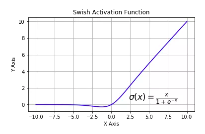

前面我们介绍了Pytorch的张量的结构操作和数学运算中的一些常用API。

利用这些张量的API我们可以构建出神经网络相关的组件(如激活函数，模型层，损失函数，优化器)。

Pytorch中：和神经网络相关的功能组件大多都封装在 torch.nn模块下。这些功能组件的绝大部分既有函数形式实现，也有类形式实现。

​	1，nn.functional(一般引入后改名为F)有各种功能组件的函数实现。

​	2，便于对参数进行管理，通过继承 nn.Module 转换成为类的实现形式，并直接封装在 nn 模块下。（建议）

tensorflow中：和神经网络相关的功能组件大多通过继承tf.keras子模块实现。所以tensorflow实现的功能组件大多数是类的形式实现的。

## 激活函数

激活函数在深度学习中扮演着非常重要的角色，它给网络赋予了非线性，从而使得神经网络能够拟合任意复杂的函数。

如果没有激活函数，无论多复杂的网络，都等价于单一的线性变换，无法对非线性函数进行拟合。

目前，深度学习中最流行的激活函数为 relu, 但也有些新推出的激活函数，例如 swish、GELU 据称效果优于relu激活函数。


### 常用激活函数

**sigmoid：**将实数压缩到0到1之间，一般只在二分类的最后输出层使用。主要缺陷为存在梯度消失问题，计算复杂度高，输出不以0为中心。


**softmax**：sigmoid的多分类扩展，一般只在多分类问题的最后输出层使用。


**tanh：**将实数压缩到-1到1之间，输出期望为0。主要缺陷为存在梯度消失问题，计算复杂度高。


**relu：**修正线性单元，最流行的激活函数。一般隐藏层使用。主要缺陷是：输出不以0为中心，输入小于0时存在梯度消失问题(死亡relu)。


**leaky_relu：**对修正线性单元的改进，解决了死亡relu问题。


**elu：**指数线性单元。对relu的改进，能够缓解死亡relu问题。


**selu：**扩展型指数线性单元。在权重用tf.keras.initializers.lecun_normal初始化前提下能够对神经网络进行自归一化。不可能出现梯度爆炸或者梯度消失问题。需要和Dropout的变种AlphaDropout一起使用。


**swish：**自门控激活函数。谷歌出品，相关研究指出用swish替代relu将获得轻微效果提升。



**gelu：**高斯误差线性单元激活函数。在Transformer中表现最好。tf.nn模块尚没有实现该函数。


### 激活函数实现


> `pytorch`

激活函数的使用方法有两种，分别是：

```python
import torch.nn.functional as F
"""
F.relu
F.sigmoid
F.tanh
F.softmax
"""
out = F.relu(input)
```

```python
import torch.nn as nn
"""
nn.ReLU
nn.Sigmoid
nn.Tanh
nn.Softmax
"""
nn.ReLU()
```

其实这两种方法都是使用relu激活，只是使用的场景不一样，F.relu()是函数调用，一般使用在foreward函数里。而nn.ReLU()是模块调用，一般在定义网络层的时候使用。(nn.ReLU(),通过继承 nn.Module 转换成为类的实现形式，并直接封装在 nn 模块下。)

**当用print(net)输出时，会有nn.ReLU()层，而F.ReLU()是没有输出的。**

```python
import torch.nn as nn
import torch.nn.functional as F

class NET1(nn.Module):
    def __init__(self):
        super(NET1, self).__init__()
        self.conv = nn.Conv2d(3, 16, 3, 1, 1)
        self.bn = nn.BatchNorm2d(16)
        self.relu = nn.ReLU()  # 模块的激活函数

    def forward(self, x):
        out = self.conv(x)
        x = self.bn(x)
        out = self.relu()
        return out


class NET2(nn.Module):
    def __init__(self):
        super(NET2, self).__init__()
        self.conv = nn.Conv2d(3, 16, 3, 1, 1)
        self.bn = nn.BatchNorm2d(16)

    def forward(self, x):
        x = self.conv(x)
        x = self.bn(x)
        out = F.relu(x)  # 函数的激活函数
        return out

net1 = NET1()
net2 = NET2()
print(net1)
print(net2)
```

> `tensorflow`

在keras模型中使用激活函数一般有两种方式，一种是作为某些层的activation参数指定，另一种是显式添加layers.Activation激活层。

```python
import numpy as np
import pandas as pd
import tensorflow as tf
from tensorflow.keras import layers,models

tf.keras.backend.clear_session()

model = models.Sequential()
model.add(layers.Dense(32,input_shape = (None,16),activation = tf.nn.relu)) #通过activation参数指定
model.add(layers.Dense(10))
"""
tf.nn.sigmoid
tf.nn.softmax
tf.nn.tanh
tf.nn.relu
tf.nn.leaky_relu
tf.nn.elu
tf.nn.selu
tf.nn.swish
gelu
"""
model.add(layers.Activation(tf.nn.softmax))  # 显式添加layers.Activation激活层
model.summary()
```


## 模型层layers

深度学习模型一般由各种模型层组合而成。

**pytroch中：**torch.nn中内置了非常丰富的各种模型层。它们都属于nn.Module的子类，具备参数管理功能。

例如：

- nn.Linear, nn.Flatten, nn.Dropout, nn.BatchNorm2d
- nn.Conv2d,nn.AvgPool2d,nn.Conv1d,nn.ConvTranspose2d
- nn.Embedding,nn.GRU,nn.LSTM
- nn.Transformer

如果这些内置模型层不能够满足需求，我们也可以通过继承nn.Module基类构建自定义的模型层。

实际上，pytorch不区分模型和模型层，都是通过继承nn.Module进行构建。

因此，我们只要继承nn.Module基类并实现forward方法即可自定义模型层。


**tensorflow中：**tf.keras.layers内置了非常丰富的各种功能的模型层。例如，

layers.Dense,layers.Flatten,layers.Input,layers.DenseFeature,layers.Dropout

layers.Conv2D,layers.MaxPooling2D,layers.Conv1D

layers.Embedding,layers.GRU,layers.LSTM,layers.Bidirectional等等。

如果这些内置模型层不能够满足需求，我们也可以通过编写tf.keras.Lambda匿名模型层或继承tf.keras.layers.Layer基类构建自定义的模型层。

其中tf.keras.Lambda匿名模型层只适用于构造没有学习参数的模型层。


### 内置模型层

一些常用的内置模型层简单介绍如下。

***基础层***

| 名称                | pytorch             | tensorflow         |
| ------------------- | ------------------- | ------------------ |
| 输入层              |                     | Input              |
| 全连接层/密集连接层 | nn.Linear           | Dense              |
| 特征列接入层        |                     | DenseFeature       |
| 压平层              | nn.Flatten          | Flatten            |
| 随机置零层          | nn.Dropout          | Dropout            |
|                     | nn.Dropout2d        | SpatialDropout2D   |
|                     | nn.Dropout3d        |                    |
| 批标准化层          | nn.BatchNorm1d      | BatchNormalization |
|                     | nn.BatchNorm2d      |                    |
|                     | nn.BatchNorm3d      |                    |
| 限幅层              | nn.Threshold        |                    |
| 常数填充层          | nn.ConstantPad2d    |                    |
| 复制填充层          | nn.ReplicationPad1d |                    |
| 零值填充层          | nn.ZeroPad2d        |                    |
| 加法层              |                     | Add                |
| 减法层              |                     | Subtract           |
| 取最大值层          |                     | Maximum            |
| 取最小值层          |                     | Minimum            |
| 形状重塑层          |                     | Reshape            |
| 拼接层              |                     | Concatenate        |
| 组归一化            | nn.GroupNorm        |                    |
| 层归一化            | nn.LayerNorm        |                    |
| 样本归一化          | nn.InstanceNorm2d   |                    |

相关名词解释：

> `pytorch`

- nn.Linear：全连接层。参数个数 = 输入层特征数× 输出层特征数(weight)＋ 输出层特征数(bias)
- nn.Flatten：压平层，用于将多维张量样本压成一维张量样本。
- nn.BatchNorm1d：一维批标准化层。通过线性变换将输入批次缩放平移到稳定的均值和标准差。可以增强模型对输入不同分布的适应性，加快模型训练速度，有轻微正则化效果。一般在激活函数之前使用。可以用afine参数设置该层是否含有可以训练的参数。
- nn.BatchNorm2d：二维批标准化层。
- nn.BatchNorm3d：三维批标准化层。
- nn.Dropout：一维随机丢弃层。一种正则化手段。
- nn.Dropout2d：二维随机丢弃层。
- nn.Dropout3d：三维随机丢弃层。
- nn.Threshold：限幅层。当输入大于或小于阈值范围时，截断之。
- nn.ConstantPad2d： 二维常数填充层。对二维张量样本填充常数扩展长度。
- nn.ReplicationPad1d： 一维复制填充层。对一维张量样本通过复制边缘值填充扩展长度。
- nn.ZeroPad2d：二维零值填充层。对二维张量样本在边缘填充0值.
- nn.GroupNorm：组归一化。一种替代批归一化的方法，将通道分成若干组进行归一。不受batch大小限制，据称性能和效果都优于BatchNorm。
- nn.LayerNorm：层归一化。较少使用。
- nn.InstanceNorm2d: 样本归一化。较少使用。

> `tensorflow`

- Dense：密集连接层。参数个数 = 输入层特征数× 输出层特征数(weight)＋ 输出层特征数(bias)
- Activation：激活函数层。一般放在Dense层后面，等价于在Dense层中指定activation。
- Dropout：随机置零层。训练期间以一定几率将输入置0，一种正则化手段。
- BatchNormalization：批标准化层。通过线性变换将输入批次缩放平移到稳定的均值和标准差。可以增强模型对输入不同分布的适应性，加快模型训练速度，有轻微正则化效果。一般在激活函数之前使用。
- SpatialDropout2D：空间随机置零层。训练期间以一定几率将整个特征图置0，一种正则化手段，有利于避免特征图之间过高的相关性。
- Input：输入层。通常使用Functional API方式构建模型时作为第一层。
- DenseFeature：特征列接入层，用于接收一个特征列列表并产生一个密集连接层。
- Flatten：压平层，用于将多维张量压成一维。
- Reshape：形状重塑层，改变输入张量的形状。
- Concatenate：拼接层，将多个张量在某个维度上拼接。
- Add：加法层。
- Subtract： 减法层。
- Maximum：取最大值层。
- Minimum：取最小值层。


***卷积网络相关层***

| 名称                 | pytorch                | tensorflow         |
| -------------------- | ---------------------- | ------------------ |
| 普通一维卷积         | nn.Conv1d              | Conv1D             |
| 普通二维卷积         | nn.Conv2d              | Conv2D             |
| 普通三维卷积         | nn.Conv3d              | Conv3D             |
| 二维深度可分离卷积层 |                        | SeparableConv2D    |
| 二维深度卷积层       |                        | DepthwiseConv2D    |
| 二维卷积转置层       | nn.ConvTranspose2d     | Conv2DTranspose    |
| 二维局部连接层       |                        | LocallyConnected2D |
| 一维最大池化         | nn.MaxPool1d           | MaxPool1D          |
| 二维最大池化         | nn.MaxPool2d           | MaxPool2D          |
| 三维最大池化         | nn.MaxPool3d           | MaxPool3D          |
| 二维平均池化层       | nn.AvgPool2d           | AveragePooling2D   |
| 二维自适应最大池化   | nn.AdaptiveMaxPool2d   |                    |
| 二维分数最大池化     | nn.FractionalMaxPool2d |                    |
| 全局最大池化层       |                        | GlobalMaxPool2D    |
| 全局平均池化层       |                        | GlobalAvgPool2D    |
| 二维自适应平均池化   | nn.AdaptiveAvgPool2d   |                    |
| 上采样层             | nn.Upsample            |                    |
| 滑动窗口提取层       | nn.Unfold              |                    |
| 逆滑动窗口提取层     | nn.Fold                |                    |
|                      |                        |                    |

相关名词解释：

> `pytorch`

- nn.Conv1d：普通一维卷积，常用于文本。参数个数 = 输入通道数×卷积核尺寸(如3)×卷积核个数 + 卷积核尺寸(如3）
- nn.Conv2d：普通二维卷积，常用于图像。参数个数 = 输入通道数×卷积核尺寸(如3乘3)×卷积核个数 + 卷积核尺寸(如3乘3) 通过调整dilation参数大于1，可以变成空洞卷积，增大卷积核感受野。 通过调整groups参数不为1，可以变成分组卷积。分组卷积中不同分组使用相同的卷积核，显著减少参数数量。 当groups参数等于通道数时，相当于tensorflow中的二维深度卷积层tf.keras.layers.DepthwiseConv2D。 利用分组卷积和1乘1卷积的组合操作，可以构造相当于Keras中的二维深度可分离卷积层tf.keras.layers.SeparableConv2D。
- nn.Conv3d：普通三维卷积，常用于视频。参数个数 = 输入通道数×卷积核尺寸(如3乘3乘3)×卷积核个数 + 卷积核尺寸(如3乘3乘3) 。
- nn.MaxPool1d: 一维最大池化。
- nn.MaxPool2d：二维最大池化。一种下采样方式。没有需要训练的参数。
- nn.MaxPool3d：三维最大池化。
- nn.AdaptiveMaxPool2d：二维自适应最大池化。无论输入图像的尺寸如何变化，输出的图像尺寸是固定的。 该函数的实现原理，大概是通过输入图像的尺寸和要得到的输出图像的尺寸来反向推算池化算子的padding,stride等参数。
- nn.FractionalMaxPool2d：二维分数最大池化。普通最大池化通常输入尺寸是输出的整数倍。而分数最大池化则可以不必是整数。分数最大池化使用了一些随机采样策略，有一定的正则效果，可以用它来代替普通最大池化和Dropout层。
- nn.AvgPool2d：二维平均池化。
- nn.AdaptiveAvgPool2d：二维自适应平均池化。无论输入的维度如何变化，输出的维度是固定的。
- nn.ConvTranspose2d：二维卷积转置层，俗称反卷积层。并非卷积的逆操作，但在卷积核相同的情况下，当其输入尺寸是卷积操作输出尺寸的情况下，卷积转置的输出尺寸恰好是卷积操作的输入尺寸。在语义分割中可用于上采样。
- nn.Upsample：上采样层，操作效果和池化相反。可以通过mode参数控制上采样策略为"nearest"最邻近策略或"linear"线性插值策略。
- nn.Unfold：滑动窗口提取层。其参数和卷积操作nn.Conv2d相同。实际上，卷积操作可以等价于nn.Unfold和nn.Linear以及nn.Fold的一个组合。 其中nn.Unfold操作可以从输入中提取各个滑动窗口的数值矩阵，并将其压平成一维。利用nn.Linear将nn.Unfold的输出和卷积核做乘法后，再使用 nn.Fold操作将结果转换成输出图片形状。
- nn.Fold：逆滑动窗口提取层。

> `tensorflow`

- Conv1D：普通一维卷积，常用于文本。参数个数 = 输入通道数×卷积核尺寸(如3)×卷积核个数
- Conv2D：普通二维卷积，常用于图像。参数个数 = 输入通道数×卷积核尺寸(如3乘3)×卷积核个数
- Conv3D：普通三维卷积，常用于视频。参数个数 = 输入通道数×卷积核尺寸(如3乘3乘3)×卷积核个数
- SeparableConv2D：二维深度可分离卷积层。不同于普通卷积同时对区域和通道操作，深度可分离卷积先操作区域，再操作通道。即先对每个通道做独立卷积操作区域，再用1乘1卷积跨通道组合操作通道。参数个数 = 输入通道数×卷积核尺寸 + 输入通道数×1×1×输出通道数。深度可分离卷积的参数数量一般远小于普通卷积，效果一般也更好。
- DepthwiseConv2D：二维深度卷积层。仅有SeparableConv2D前半部分操作，即只操作区域，不操作通道，一般输出通道数和输入通道数相同，但也可以通过设置depth_multiplier让输出通道为输入通道的若干倍数。输出通道数 = 输入通道数 × depth_multiplier。参数个数 = 输入通道数×卷积核尺寸× depth_multiplier。
- Conv2DTranspose：二维卷积转置层，俗称反卷积层。并非卷积的逆操作，但在卷积核相同的情况下，当其输入尺寸是卷积操作输出尺寸的情况下，卷积转置的输出尺寸恰好是卷积操作的输入尺寸。
- LocallyConnected2D: 二维局部连接层。类似Conv2D，唯一的差别是没有空间上的权值共享，所以其参数个数远高于二维卷积。
- MaxPool2D: 二维最大池化层。也称作下采样层。池化层无可训练参数，主要作用是降维。
- AveragePooling2D: 二维平均池化层。
- GlobalMaxPool2D: 全局最大池化层。每个通道仅保留一个值。一般从卷积层过渡到全连接层时使用，是Flatten的替代方案。
- GlobalAvgPool2D: 全局平均池化层。每个通道仅保留一个值。


***循环网络相关层***

| 名称                   | pytroch      | tensorflow      |
| ---------------------- | ------------ | --------------- |
| 嵌入层                 | nn.Embedding | Embedding       |
| 长短记忆循环网络层     | nn.LSTM      | LSTM            |
| 门控循环网络层         | nn.GRU       | GRU             |
| 简单循环网络层         | nn.RNN       | SimpleRNN       |
| 卷积长短记忆循环网络层 |              | ConvLSTM2D      |
| 双向循环网络包装器     |              | Bidirectional   |
| RNN基本层              |              | RNN             |
| 长短记忆循环网络单元   | nn.LSTMCell  | LSTMCell        |
| 门控循环网络单元       | nn.GRUCell   | GRUCell         |
| 简单循环网络单元       | nn.RNNCell   | SimpleRNNCell   |
| 抽象RNN单元            |              | AbstractRNNCell |

相关名词解释：

> `pytorch`

- nn.Embedding：嵌入层。一种比Onehot更加有效的对离散特征进行编码的方法。一般用于将输入中的单词映射为稠密向量。嵌入层的参数需要学习。
- nn.LSTM：长短记忆循环网络层【支持多层】。最普遍使用的循环网络层。具有携带轨道，遗忘门，更新门，输出门。可以较为有效地缓解梯度消失问题，从而能够适用长期依赖问题。设置bidirectional = True时可以得到双向LSTM。需要注意的时，默认的输入和输出形状是(seq,batch,feature), 如果需要将batch维度放在第0维，则要设置batch_first参数设置为True。
- nn.GRU：门控循环网络层【支持多层】。LSTM的低配版，不具有携带轨道，参数数量少于LSTM，训练速度更快。
- nn.RNN：简单循环网络层【支持多层】。容易存在梯度消失，不能够适用长期依赖问题。一般较少使用。
- nn.LSTMCell：长短记忆循环网络单元。和nn.LSTM在整个序列上迭代相比，它仅在序列上迭代一步。一般较少使用。
- nn.GRUCell：门控循环网络单元。和nn.GRU在整个序列上迭代相比，它仅在序列上迭代一步。一般较少使用。
- nn.RNNCell：简单循环网络单元。和nn.RNN在整个序列上迭代相比，它仅在序列上迭代一步。一般较少使用。

> `tensorflow`

- Embedding：嵌入层。一种比Onehot更加有效的对离散特征进行编码的方法。一般用于将输入中的单词映射为稠密向量。嵌入层的参数需要学习。
- LSTM：长短记忆循环网络层。最普遍使用的循环网络层。具有携带轨道，遗忘门，更新门，输出门。可以较为有效地缓解梯度消失问题，从而能够适用长期依赖问题。设置return_sequences = True时可以返回各个中间步骤输出，否则只返回最终输出。
- GRU：门控循环网络层。LSTM的低配版，不具有携带轨道，参数数量少于LSTM，训练速度更快。
- SimpleRNN：简单循环网络层。容易存在梯度消失，不能够适用长期依赖问题。一般较少使用。
- ConvLSTM2D：卷积长短记忆循环网络层。结构上类似LSTM，但对输入的转换操作和对状态的转换操作都是卷积运算。
- Bidirectional：双向循环网络包装器。可以将LSTM，GRU等层包装成双向循环网络。从而增强特征提取能力。
- RNN：RNN基本层。接受一个循环网络单元或一个循环单元列表，通过调用tf.keras.backend.rnn函数在序列上进行迭代从而转换成循环网络层。
- LSTMCell：LSTM单元。和LSTM在整个序列上迭代相比，它仅在序列上迭代一步。可以简单理解LSTM即RNN基本层包裹LSTMCell。
- GRUCell：GRU单元。和GRU在整个序列上迭代相比，它仅在序列上迭代一步。
- SimpleRNNCell：SimpleRNN单元。和SimpleRNN在整个序列上迭代相比，它仅在序列上迭代一步。
- AbstractRNNCell：抽象RNN单元。通过对它的子类化用户可以自定义RNN单元，再通过RNN基本层的包裹实现用户自定义循环网络层。


***Transformer相关层***

| 名称                        | pytorch                    | tensorflow        |
| --------------------------- | -------------------------- | ----------------- |
| Dot-product类型注意力机制层 |                            | Attention         |
| Additive类型注意力机制层    |                            | AdditiveAttention |
| 时间分布包装器              |                            | TimeDistributed   |
| Transformer网络结构         | nn.Transformer             |                   |
| Transformer编码器结构       | nn.TransformerEncoder      |                   |
| Transformer解码器结构       | nn.TransformerDecoder      |                   |
| Transformer的编码器层       | nn.TransformerEncoderLayer |                   |
| Transformer的解码器层       | nn.TransformerDecoderLayer |                   |
| 多头注意力层                | nn.MultiheadAttention      |                   |

相关名词解释：

> `pytorch`

- nn.Transformer：Transformer网络结构。Transformer网络结构是替代循环网络的一种结构，解决了循环网络难以并行，难以捕捉长期依赖的缺陷。它是目前NLP任务的主流模型的主要构成部分。Transformer网络结构由TransformerEncoder编码器和TransformerDecoder解码器组成。编码器和解码器的核心是MultiheadAttention多头注意力层。
- nn.TransformerEncoder：Transformer编码器结构。由多个 nn.TransformerEncoderLayer编码器层组成。
- nn.TransformerDecoder：Transformer解码器结构。由多个 nn.TransformerDecoderLayer解码器层组成。
- nn.TransformerEncoderLayer：Transformer的编码器层。
- nn.TransformerDecoderLayer：Transformer的解码器层。
- nn.MultiheadAttention：多头注意力层。

> `tensorflow`

- Attention：Dot-product类型注意力机制层。可以用于构建注意力模型。
- AdditiveAttention：Additive类型注意力机制层。可以用于构建注意力模型。
- TimeDistributed：时间分布包装器。包装后可以将Dense、Conv2D等作用到每一个时间片段上。


### 自定义模型层

如果内置模型层不能够满足需求，我们也可以通过继承nn.Module(pytorch)或者keras.layers(tensorflow)基类构建自定义的模型层。


> `pytorch`

实际上，pytorch不区分模型和模型层，都是通过继承nn.Module进行构建。

因此，我们只要继承nn.Module基类并实现forward方法即可自定义模型层。

下面是Pytorch的nn.Linear层的源码，我们可以仿照它来自定义模型层。

```python
import torch
from torch import nn
import torch.nn.functional as F


class Linear(nn.Module):
    __constants__ = ['in_features', 'out_features']

    def __init__(self, in_features, out_features, bias=True):
        super(Linear, self).__init__()
        self.in_features = in_features
        self.out_features = out_features
        self.weight = nn.Parameter(torch.Tensor(out_features, in_features))
        if bias:
            self.bias = nn.Parameter(torch.Tensor(out_features))
        else:
            self.register_parameter('bias', None)
        self.reset_parameters()

    def reset_parameters(self):
        nn.init.kaiming_uniform_(self.weight, a=math.sqrt(5))
        if self.bias is not None:
            fan_in, _ = nn.init._calculate_fan_in_and_fan_out(self.weight)
            bound = 1 / math.sqrt(fan_in)
            nn.init.uniform_(self.bias, -bound, bound)

    def forward(self, input):
        return F.linear(input, self.weight, self.bias)

    def extra_repr(self):
        return 'in_features={}, out_features={}, bias={}'.format(
            self.in_features, self.out_features, self.bias is not None
        )
```

```python
linear = nn.Linear(20, 30)
inputs = torch.randn(128, 20)
output = linear(inputs)
print(output.size())
```

```python
# torch.Size([128, 30])
```


> `tensorflow`

如果自定义模型层没有需要被训练的参数，一般推荐使用Lamda层实现。

如果自定义模型层有需要被训练的参数，则可以通过对Layer基类子类化实现。

Lambda层由于没有需要被训练的参数，只需要定义正向传播逻辑即可，使用比Layer基类子类化更加简单。

Lambda层的正向逻辑可以使用Python的lambda函数来表达，也可以用def关键字定义函数来表达。

```python
import tensorflow as tf
from tensorflow.keras import layers,models,regularizers

mypower = layers.Lambda(lambda x:tf.math.pow(x,2))
mypower(tf.range(5))
# <tf.Tensor: shape=(5,), dtype=int32, numpy=array([ 0,  1,  4,  9, 16], dtype=int32)>
```

Layer的子类化一般需要重新实现初始化方法，Build方法和Call方法。下面是一个简化的线性层的范例，类似Dense.

```python
class Linear(layers.Layer):
    def __init__(self, units=32, **kwargs):
        super(Linear, self).__init__(**kwargs)
        self.units = units
    
    #build方法一般定义Layer需要被训练的参数。    
    def build(self, input_shape): 
        self.w = self.add_weight("w",shape=(input_shape[-1], self.units),
                                 initializer='random_normal',
                                 trainable=True) #注意必须要有参数名称"w",否则会报错
        self.b = self.add_weight("b",shape=(self.units,),
                                 initializer='random_normal',
                                 trainable=True)
        super(Linear,self).build(input_shape) # 相当于设置self.built = True

    #call方法一般定义正向传播运算逻辑，__call__方法调用了它。  
    @tf.function
    def call(self, inputs): 
        return tf.matmul(inputs, self.w) + self.b
    
    #如果要让自定义的Layer通过Functional API 组合成模型时可以被保存成h5模型，需要自定义get_config方法。
    def get_config(self):  
        config = super(Linear, self).get_config()
        config.update({'units': self.units})
        return config
```

```python
linear = Linear(units = 8)
print(linear.built)
#指定input_shape，显式调用build方法，第0维代表样本数量，用None填充
linear.build(input_shape = (None,16)) 
print(linear.built)
# False
# True
```

```python
linear = Linear(units = 8)
print(linear.built)
linear.build(input_shape = (None,16)) 
print(linear.compute_output_shape(input_shape = (None,16)))

# False
# (None, 8)
```

```python
linear = Linear(units = 16)
print(linear.built)
#如果built = False，调用__call__时会先调用build方法, 再调用call方法。
linear(tf.random.uniform((100,64))) 
print(linear.built)
config = linear.get_config()
print(config)

# False
# True
# {'name': 'linear_3', 'trainable': True, 'dtype': 'float32', 'units': 16}
```

```python
tf.keras.backend.clear_session()

model = models.Sequential()
#注意该处的input_shape会被模型加工，无需使用None代表样本数量维
model.add(Linear(units = 1,input_shape = (2,)))  
print("model.input_shape: ",model.input_shape)
print("model.output_shape: ",model.output_shape)
model.summary()
model.input_shape:  (None, 2)
model.output_shape:  (None, 1)
'''
Model: "sequential"
_________________________________________________________________
Layer (type)                 Output Shape              Param #   
=================================================================
linear (Linear)              (None, 1)                 3         
=================================================================
Total params: 3
Trainable params: 3
Non-trainable params: 0
_________________________________________________________________
'''
```

```python
model.compile(optimizer = "sgd",loss = "mse",metrics=["mae"])
print(model.predict(tf.constant([[3.0,2.0],[4.0,5.0]])))
# [[-0.04092304]
#  [-0.06150477]]
```

```python
# 保存成 h5模型
model.save("./data/linear_model.h5",save_format = "h5")
model_loaded_keras = tf.keras.models.load_model(
    "./data/linear_model.h5",custom_objects={"Linear":Linear})
print(model_loaded_keras.predict(tf.constant([[3.0,2.0],[4.0,5.0]])))
# [[-0.04092304]
#  [-0.06150477]]
```

```python
# 保存成 tf模型
model.save("./data/linear_model",save_format = "tf")
model_loaded_tf = tf.keras.models.load_model("./data/linear_model")
print(model_loaded_tf.predict(tf.constant([[3.0,2.0],[4.0,5.0]])))
# INFO:tensorflow:Assets written to: ./data/linear_model/assets
# [[-0.04092304]
#  [-0.06150477]]
```


## 损失函数loss


一般来说，监督学习的目标函数由损失函数和正则化项组成。（Objective = Loss + Regularization）

**pytorch中：**Pytorch中的损失函数一般在训练模型时候指定。

注意Pytorch中内置的损失函数的参数和tensorflow不同，是y_pred在前，y_true在后，而Tensorflow是y_true在前，y_pred在后。

对于回归模型，通常使用的内置损失函数是均方损失函数nn.MSELoss 。

对于二分类模型，通常使用的是二元交叉熵损失函数nn.BCELoss (输入已经是sigmoid激活函数之后的结果) 或者 nn.BCEWithLogitsLoss (输入尚未经过nn.Sigmoid激活函数) 。

对于多分类模型，一般推荐使用交叉熵损失函数 nn.CrossEntropyLoss。 (y_true需要是一维的，是类别编码。y_pred未经过nn.Softmax激活。)

此外，如果多分类的y_pred经过了nn.LogSoftmax激活，可以使用nn.NLLLoss损失函数(The negative log likelihood loss)。 这种方法和直接使用nn.CrossEntropyLoss等价。

如果有需要，也可以自定义损失函数，自定义损失函数需要接收两个张量y_pred，y_true作为输入参数，并输出一个标量作为损失函数值。

Pytorch中的正则化项一般通过自定义的方式和损失函数一起添加作为目标函数。

如果仅仅使用L2正则化，也可以利用优化器的weight_decay参数来实现相同的效果。

**tensorflow中：**

对于keras模型，目标函数中的正则化项一般在各层中指定，例如使用Dense的 kernel_regularizer 和 bias_regularizer等参数指定权重使用l1或者l2正则化项，此外还可以用kernel_constraint 和 bias_constraint等参数约束权重的取值范围，这也是一种正则化手段。

损失函数在模型编译时候指定。对于回归模型，通常使用的损失函数是均方损失函数 mean_squared_error。

对于二分类模型，通常使用的是二元交叉熵损失函数 binary_crossentropy。

对于多分类模型，如果label是one-hot编码的，则使用类别交叉熵损失函数 categorical_crossentropy。如果label是类别序号编码的，则需要使用稀疏类别交叉熵损失函数 sparse_categorical_crossentropy。

如果有需要，也可以自定义损失函数，自定义损失函数需要接收两个张量y_true,y_pred作为输入参数，并输出一个标量作为损失函数值。


### 内置损失函数

内置的损失函数一般有类的实现和函数的实现两种形式。

**pytorhc中：**如：nn.BCE 和 F.binary_cross_entropy 都是二元交叉熵损失函数，前者是类的实现形式，后者是函数的实现形式。

实际上类的实现形式通常是调用函数的实现形式并用nn.Module封装后得到的。

一般我们常用的是类的实现形式。它们封装在torch.nn模块下，并且类名以Loss结尾。

```python
import numpy as np
import pandas as pd
import torch 
from torch import nn 
import torch.nn.functional as F 


y_pred = torch.tensor([[10.0,0.0,-10.0],[8.0,8.0,8.0]])
y_true = torch.tensor([0,2])

# 直接调用交叉熵损失
ce = nn.CrossEntropyLoss()(y_pred,y_true)
print(ce)

# 等价于先计算nn.LogSoftmax激活，再调用NLLLoss
y_pred_logsoftmax = nn.LogSoftmax(dim = 1)(y_pred)
nll = nn.NLLLoss()(y_pred_logsoftmax,y_true)
print(nll)
# tensor(0.5493)
# tensor(0.5493)
```

**tensorflow中：**如：CategoricalCrossentropy 和 categorical_crossentropy 都是类别交叉熵损失函数，前者是类的实现形式，后者是函数的实现形式。


常用的一些内置损失函数说明如下。

| 损失函数类型           | pytorch                         | tensorflow                      |
| ---------------------- | ------------------------------- | ------------------------------- |
| 均方误差损失           | nn.MSELoss                      | mean_squared_error              |
| 绝对值误差损失         | nn.L1Loss                       | mean_absolute_error             |
| 平滑L1损失             | nn.SmoothL1Loss                 |                                 |
| 平均百分比误差损失     |                                 | mean_absolute_percentage_error  |
| Huber损失              |                                 | Huber                           |
| 二元交叉熵             | nn.BCELoss/nn.BCEWithLogitsLoss | binary_crossentropy             |
| 类别交叉熵             | nn.CrossEntropyLoss             | categorical_crossentropy        |
| 稀疏类别交叉熵         |                                 | sparse_categorical_crossentropy |
| 合页损失函数           |                                 | sparse_categorical_crossentropy |
| 负对数似然损失         | nn.NLLLoss                      |                                 |
| 余弦相似度             | nn.CosineSimilarity             | cosine_similarity               |
| 分布很不均衡的损失函数 | nn.AdaptiveLogSoftmaxWithLoss   |                                 |
| 相对熵损失             |                                 | kld                             |

名词解释：

> `pytorch`

- nn.MSELoss（均方误差损失，也叫做L2损失，用于回归）
- nn.L1Loss （L1损失，也叫做绝对值误差损失，用于回归）
- nn.SmoothL1Loss (平滑L1损失，当输入在-1到1之间时，平滑为L2损失，用于回归)
- nn.BCELoss (二元交叉熵，用于二分类，输入已经过nn.Sigmoid激活，对不平衡数据集可以用weigths参数调整类别权重)
- nn.BCEWithLogitsLoss (二元交叉熵，用于二分类，输入未经过nn.Sigmoid激活)
- nn.CrossEntropyLoss (交叉熵，用于多分类，要求label为稀疏编码，输入未经过nn.Softmax激活，对不平衡数据集可以用weigths参数调整类别权重)
- nn.NLLLoss (负对数似然损失，用于多分类，要求label为稀疏编码，输入经过nn.LogSoftmax激活)
- nn.CosineSimilarity(余弦相似度，可用于多分类)
- nn.AdaptiveLogSoftmaxWithLoss (一种适合非常多类别且类别分布很不均衡的损失函数，会自适应地将多个小类别合成一个cluster)

更多损失函数的介绍参考如下知乎文章：

《PyTorch的十八个损失函数》https://zhuanlan.zhihu.com/p/61379965


> `tensorflow`

- mean_squared_error（均方误差损失，用于回归，简写为 mse, 类与函数实现形式分别为 MeanSquaredError 和 MSE）
- mean_absolute_error (平均绝对值误差损失，用于回归，简写为 mae, 类与函数实现形式分别为 MeanAbsoluteError 和 MAE)
- mean_absolute_percentage_error (平均百分比误差损失，用于回归，简写为 mape, 类与函数实现形式分别为 MeanAbsolutePercentageError 和 MAPE)
- Huber(Huber损失，只有类实现形式，用于回归，介于mse和mae之间，对异常值比较鲁棒，相对mse有一定的优势)
- binary_crossentropy(二元交叉熵，用于二分类，类实现形式为 BinaryCrossentropy)
- categorical_crossentropy(类别交叉熵，用于多分类，要求label为onehot编码，类实现形式为 CategoricalCrossentropy)
- sparse_categorical_crossentropy(稀疏类别交叉熵，用于多分类，要求label为序号编码形式，类实现形式为 SparseCategoricalCrossentropy)
- hinge(合页损失函数，用于二分类，最著名的应用是作为支持向量机SVM的损失函数，类实现形式为 Hinge)
- kld(相对熵损失，也叫KL散度，常用于最大期望算法EM的损失函数，两个概率分布差异的一种信息度量。类与函数实现形式分别为 KLDivergence 或 KLD)
- cosine_similarity(余弦相似度，可用于多分类，类实现形式为 CosineSimilarity)


### 自定义损失函数

自定义损失函数接收两个张量y_pred,y_true（tensorflow为y_true,y_pred）作为输入参数，并输出一个标量作为损失函数值。

pytorch中：也可以对nn.Module进行子类化，重写forward方法实现损失的计算逻辑，从而得到损失函数的类的实现。

tensorflow中：也可以对tf.keras.losses.Loss进行子类化，重写call方法实现损失的计算逻辑，从而得到损失函数的类的实现。

下面是一个Focal Loss的自定义实现示范。Focal Loss是一种对binary_crossentropy的改进损失函数形式。

它在样本不均衡和存在较多易分类的样本时相比binary_crossentropy具有明显的优势。

它有两个可调参数，alpha参数和gamma参数。其中alpha参数主要用于衰减负样本的权重，gamma参数主要用于衰减容易训练样本的权重。

从而让模型更加聚焦在正样本和困难样本上。这就是为什么这个损失函数叫做Focal Loss。

详见《5分钟理解Focal Loss与GHM——解决样本不平衡利器》

https://zhuanlan.zhihu.com/p/80594704

> `pytorch`

```python
class FocalLoss(nn.Module):
    
    def __init__(self,gamma=2.0,alpha=0.75):
        super().__init__()
        self.gamma = gamma
        self.alpha = alpha

    def forward(self,y_pred,y_true):
        bce = torch.nn.BCELoss(reduction = "none")(y_pred,y_true)
        p_t = (y_true * y_pred) + ((1 - y_true) * (1 - y_pred))
        alpha_factor = y_true * self.alpha + (1 - y_true) * (1 - self.alpha)
        modulating_factor = torch.pow(1.0 - p_t, self.gamma)
        loss = torch.mean(alpha_factor * modulating_factor * bce)
        return loss
```

```python
#困难样本
y_pred_hard = torch.tensor([[0.5],[0.5]])
y_true_hard = torch.tensor([[1.0],[0.0]])

#容易样本
y_pred_easy = torch.tensor([[0.9],[0.1]])
y_true_easy = torch.tensor([[1.0],[0.0]])

focal_loss = FocalLoss()
bce_loss = nn.BCELoss()

print("focal_loss(hard samples):", focal_loss(y_pred_hard,y_true_hard))
print("bce_loss(hard samples):", bce_loss(y_pred_hard,y_true_hard))
print("focal_loss(easy samples):", focal_loss(y_pred_easy,y_true_easy))
print("bce_loss(easy samples):", bce_loss(y_pred_easy,y_true_easy))

#可见 focal_loss让容易样本的权重衰减到原来的 0.0005/0.1054 = 0.00474
#而让困难样本的权重只衰减到原来的 0.0866/0.6931=0.12496

# 因此相对而言，focal_loss可以衰减容易样本的权重。
# focal_loss(hard samples): tensor(0.0866)
# bce_loss(hard samples): tensor(0.6931)
# focal_loss(easy samples): tensor(0.0005)
# bce_loss(easy samples): tensor(0.1054)
```

> `tensorflow`

```python
def focal_loss(gamma=2., alpha=0.75):
    
    def focal_loss_fixed(y_true, y_pred):
        bce = tf.losses.binary_crossentropy(y_true, y_pred)
        p_t = (y_true * y_pred) + ((1 - y_true) * (1 - y_pred))
        alpha_factor = y_true * alpha + (1 - y_true) * (1 - alpha)
        modulating_factor = tf.pow(1.0 - p_t, gamma)
        loss = tf.reduce_sum(alpha_factor * modulating_factor * bce,axis = -1 )
        return loss
    return focal_loss_fixed
```

```python
class FocalLoss(tf.keras.losses.Loss):
    
    def __init__(self,gamma=2.0,alpha=0.75,name = "focal_loss"):
        self.gamma = gamma
        self.alpha = alpha

    def call(self,y_true,y_pred):
        bce = tf.losses.binary_crossentropy(y_true, y_pred)
        p_t = (y_true * y_pred) + ((1 - y_true) * (1 - y_pred))
        alpha_factor = y_true * self.alpha + (1 - y_true) * (1 - self.alpha)
        modulating_factor = tf.pow(1.0 - p_t, self.gamma)
        loss = tf.reduce_sum(alpha_factor * modulating_factor * bce,axis = -1 )
        return loss
```


### 正则化项(L1,L2)

> `pytorch`

通常认为L1 正则化可以产生稀疏权值矩阵，即产生一个稀疏模型，可以用于特征选择。

而L2 正则化可以防止模型过拟合（overfitting）。一定程度上，L1也可以防止过拟合。

下面以一个二分类问题为例，演示给模型的目标函数添加自定义L1和L2正则化项的方法。

这个范例同时演示了上一个部分的FocalLoss的使用。

```python
# 定义模型
class DNNModel(torchkeras.Model):
    def __init__(self):
        super(DNNModel, self).__init__()
        self.fc1 = nn.Linear(2,4)
        self.fc2 = nn.Linear(4,8) 
        self.fc3 = nn.Linear(8,1)
        
    def forward(self,x):
        x = F.relu(self.fc1(x))
        x = F.relu(self.fc2(x))
        y = nn.Sigmoid()(self.fc3(x))
        return y
        
model = DNNModel()

model.summary(input_shape =(2,))
"""
----------------------------------------------------------------
        Layer (type)               Output Shape         Param #
================================================================
            Linear-1                    [-1, 4]              12
            Linear-2                    [-1, 8]              40
            Linear-3                    [-1, 1]               9
================================================================
Total params: 61
Trainable params: 61
Non-trainable params: 0
----------------------------------------------------------------
Input size (MB): 0.000008
Forward/backward pass size (MB): 0.000099
Params size (MB): 0.000233
Estimated Total Size (MB): 0.000340
----------------------------------------------------------------
"""
```

```python
# 准确率
def accuracy(y_pred,y_true):
    y_pred = torch.where(y_pred>0.5,torch.ones_like(y_pred,dtype = torch.float32),
                      torch.zeros_like(y_pred,dtype = torch.float32))
    acc = torch.mean(1-torch.abs(y_true-y_pred))
    return acc

# L2正则化
def L2Loss(model,alpha):
    l2_loss = torch.tensor(0.0, requires_grad=True)
    for name, param in model.named_parameters():
        if 'bias' not in name: #一般不对偏置项使用正则
            l2_loss = l2_loss + (0.5 * alpha * torch.sum(torch.pow(param, 2)))
    return l2_loss

# L1正则化
def L1Loss(model,beta):
    l1_loss = torch.tensor(0.0, requires_grad=True)
    for name, param in model.named_parameters():
        if 'bias' not in name:
            l1_loss = l1_loss +  beta * torch.sum(torch.abs(param))
    return l1_loss

# 将L2正则和L1正则添加到FocalLoss损失，一起作为目标函数
def focal_loss_with_regularization(y_pred,y_true):
    focal = FocalLoss()(y_pred,y_true) 
    l2_loss = L2Loss(model,0.001) #注意设置正则化项系数
    l1_loss = L1Loss(model,0.001)
    total_loss = focal + l2_loss + l1_loss
    return total_loss

# 编译模型的时候使用定义的损失函数即可
model.compile(loss_func =focal_loss_with_regularization,
              optimizer= torch.optim.Adam(model.parameters(),lr = 0.01),
             metrics_dict={"accuracy":accuracy})

dfhistory = model.fit(30,dl_train = dl_train,dl_val = dl_valid,log_step_freq = 30)
```


> `tensorflow`

```python
tf.keras.backend.clear_session()

model = models.Sequential()
model.add(layers.Dense(64, input_dim=64,
                kernel_regularizer=regularizers.l2(0.01), 
                activity_regularizer=regularizers.l1(0.01),
                kernel_constraint = constraints.MaxNorm(max_value=2, axis=0))) 
# 正则化项作为添加层（最后一层）的参数kernel_regularizer添加即可。
model.add(layers.Dense(10,
        kernel_regularizer=regularizers.l1_l2(0.01,0.01),activation = "sigmoid"))
model.compile(optimizer = "rmsprop",
        loss = "binary_crossentropy",metrics = ["AUC"])
model.summary()
"""
Model: "sequential"
_________________________________________________________________
Layer (type)                 Output Shape              Param #   
=================================================================
dense (Dense)                (None, 64)                4160      
_________________________________________________________________
dense_1 (Dense)              (None, 10)                650       
=================================================================
Total params: 4,810
Trainable params: 4,810
Non-trainable params: 0
_________________________________________________________________
"""
```


## 优化器optimizer

神经网络优化器，主要是为了优化我们的神经网络，使他在我们的训练过程中快起来（主要是让梯度下降的速度更快），节省社交网络训练的时间。在pytorch中提供了torch.optim方法优化我们的神经网络，torch.optim是实现各种优化算法的包。最常用的方法都已经支持，接口很常规，所以以后也可以很容易地集成更复杂的方法。
模型优化算法的选择直接关系到最终模型的性能。有时候效果不好，未必是特征的问题或者模型设计的问题，很可能就是优化算法的问题。

深度学习优化算法大概经历了 SGD -> SGDM -> NAG ->Adagrad -> Adadelta(RMSprop) -> Adam -> Nadam 这样的发展历程。

详见《一个框架看懂优化算法之异同 SGD/AdaGrad/Adam》

https://zhuanlan.zhihu.com/p/32230623

对于一般新手炼丹师，优化器直接使用Adam，并使用其默认参数就OK了。

一些爱写论文的炼丹师由于追求评估指标效果，可能会偏爱前期使用Adam优化器快速下降，后期使用SGD并精调优化器参数得到更好的结果。

此外目前也有一些前沿的优化算法，据称效果比Adam更好，例如LazyAdam, Look-ahead, RAdam, Ranger等。

 

SGD和Adam


### 内置优化器

**在pytorch中：**optim模块，提供了多种可直接使用的深度学习优化器，内置算法包括Adam、SGD、RMSprop等，无需人工实现随机梯度下降算法，直接调用即可。

**在tensorflow中：**在keras.optimizers子模块中，它们基本上都有对应的类的实现。

| 名称                         | pytorch                | tensorflow |
| ---------------------------- | ---------------------- | ---------- |
| 随机梯度下降算法             | torch.optim.SGD()      | SGD        |
| 弹性反向传播算法             | torch.optim.Rprop()    |            |
| 平均随机梯度下降算法         | torch.optim.ASGD()     |            |
| 考虑了二阶动量               | torch.optim.RMSprop()  | RMSprop    |
| 考虑了自适应二阶动量         | torch.optim.Adadelta() | Adadelta   |
| 考虑了二阶动量               | torch.optim.Adagrad()  | Adagrad    |
| 同时考虑了一阶动量和二阶动量 | torch.optim.Adam()     | Adam       |
| Adamax算法                   | torch.optim.Adamax()   |            |
| L-BFGS算法                   | torch.optim.LBFGS()    |            |

- SGD, 默认参数为纯SGD, 设置momentum参数不为0实际上变成SGDM, 考虑了一阶动量, 设置 nesterov为True后变成NAG，即 Nesterov Accelerated Gradient，在计算梯度时计算的是向前走一步所在位置的梯度。
- Adagrad, 考虑了二阶动量，对于不同的参数有不同的学习率，即自适应学习率。缺点是学习率单调下降，可能后期学习速率过慢乃至提前停止学习。
- RMSprop, 考虑了二阶动量，对于不同的参数有不同的学习率，即自适应学习率，对Adagrad进行了优化，通过指数平滑只考虑一定窗口内的二阶动量。
- Adadelta, 考虑了二阶动量，与RMSprop类似，但是更加复杂一些，自适应性更强。
- Adam, 同时考虑了一阶动量和二阶动量，可以看成RMSprop上进一步考虑了一阶动量。
- Nadam, 在Adam基础上进一步考虑了 Nesterov Acceleration。


### 优化器的使用

> `pytroch`

要构造一个Optimizer，你必须给它一个包含参数（必须都是Variable对象）进行优化。然后，您可以指定optimizer的参 数选项，比如学习率，权重衰减等。具体参考torch.optim中文文档。

```python
import torch.optim

optimizer = optim.SGD(model.parameters(), lr = 0.01, momentum=0.9)
optimizer = optim.Adam([var1, var2], lr = 0.0001)
```

```python
import torch
 
# 创建样本
x = torch.randn(64 1000)
y = torch.randn(64, 10)
 
# 定义模型
model = torch.nn.Sequential(
          torch.nn.Linear(D_in, H),
          torch.nn.ReLU(),
          torch.nn.Linear(H, D_out),
        )
loss_fn = torch.nn.MSELoss(size_average=False)
 
# Use the optim package to define an Optimizer that will update the weights of
# the model for us. Here we will use Adam; the optim package contains many other
# optimization algoriths. The first argument to the Adam constructor tells the
# optimizer which Tensors it should update.
# 创建优化器
learning_rate = 1e-4
optimizer = torch.optim.Adam(model.parameters(), lr=learning_rate)
# 开始训练
for t in range(500):
  # Forward pass: compute predicted y by passing x to the model.
  y_pred = model(x) 
  # Compute and print loss.
  loss = loss_fn(y_pred, y)
  print(t, loss.item())
  
  # Before the backward pass, use the optimizer object to zero all of the
  # gradients for the Tensors it will update (which are the learnable weights
  # of the model)
  # 优化器优化过程
  optimizer.zero_grad()
  # Backward pass: compute gradient of the loss with respect to model parameters
  loss.backward()
  # Calling the step function on an Optimizer makes an update to its parameters
  optimizer.step()

```


> `tensorflow`

优化器主要使用apply_gradients方法传入变量和对应梯度从而来对给定变量进行迭代，或者直接使用minimize方法对目标函数进行迭代优化。

当然，更常见的使用是在编译时将优化器传入keras的Model,通过调用model.fit实现对Loss的的迭代优化。

初始化优化器时会创建一个变量optimier.iterations用于记录迭代的次数。因此优化器和tf.Variable一样，一般需要在@tf.function外创建。

```python
import numpy as np 
import tensorflow as tf
```

```python
# 求f(x) = a*x**2 + b*x + c的最小值

# 使用optimizer.apply_gradients

x = tf.Variable(0.0,name = "x",dtype = tf.float32)
optimizer = tf.keras.optimizers.SGD(learning_rate=0.01)

@tf.function
def minimizef():
    a = tf.constant(1.0)
    b = tf.constant(-2.0)
    c = tf.constant(1.0)
    
    while tf.constant(True): 
        with tf.GradientTape() as tape:
            y = a*tf.pow(x,2) + b*x + c
        dy_dx = tape.gradient(y,x)
        optimizer.apply_gradients(grads_and_vars=[(dy_dx,x)])
        
        #迭代终止条件
        if tf.abs(dy_dx)<tf.constant(0.00001):
            break
            
        if tf.math.mod(optimizer.iterations,100)==0:
            printbar()
            tf.print("step = ",optimizer.iterations)
            tf.print("x = ", x)
            tf.print("")
                
    y = a*tf.pow(x,2) + b*x + c
    return y

tf.print("y =",minimizef())
tf.print("x =",x)
```

```python
# 求f(x) = a*x**2 + b*x + c的最小值

# 使用optimizer.minimize

x = tf.Variable(0.0,name = "x",dtype = tf.float32)
optimizer = tf.keras.optimizers.SGD(learning_rate=0.01)   

def f():   
    a = tf.constant(1.0)
    b = tf.constant(-2.0)
    c = tf.constant(1.0)
    y = a*tf.pow(x,2)+b*x+c
    return(y)

@tf.function
def train(epoch = 1000):  
    for _ in tf.range(epoch):  
        optimizer.minimize(f,[x])
    tf.print("epoch = ",optimizer.iterations)
    return(f())

train(1000)
tf.print("y = ",f())
tf.print("x = ",x)
```

```python
# 求f(x) = a*x**2 + b*x + c的最小值
# 使用model.fit

tf.keras.backend.clear_session()

class FakeModel(tf.keras.models.Model):
    def __init__(self,a,b,c):
        super(FakeModel,self).__init__()
        self.a = a
        self.b = b
        self.c = c
    
    def build(self):
        self.x = tf.Variable(0.0,name = "x")
        self.built = True
    
    def call(self,features):
        loss  = self.a*(self.x)**2+self.b*(self.x)+self.c
        return(tf.ones_like(features)*loss)
    
def myloss(y_true,y_pred):
    return tf.reduce_mean(y_pred)

model = FakeModel(tf.constant(1.0),tf.constant(-2.0),tf.constant(1.0))

model.build()
model.summary()
# keras的Model,通过调用model.fit实现
model.compile(optimizer = 
              tf.keras.optimizers.SGD(learning_rate=0.01),loss = myloss)
history = model.fit(tf.zeros((100,2)),
                    tf.ones(100),batch_size = 1,epochs = 10)  #迭代1000次
tf.print("x=",model.x)
tf.print("loss=",model(tf.constant(0.0)))
```


## 评估指标metrics

损失函数除了作为模型训练时候的优化目标，也能够作为模型好坏的一种评价指标。但通常人们还会从其它角度评估模型的好坏。

这就是评估指标。通常损失函数都可以作为评估指标，如MAE,MSE,CategoricalCrossentropy等也是常用的评估指标。

但评估指标不一定可以作为损失函数，例如AUC,Accuracy,Precision。因为评估指标不要求连续可导，而损失函数通常要求连续可导。

编译模型时，可以通过列表形式指定多个评估指标。

如果有需要，也可以自定义评估指标。

**tensorflow中：**可以对tf.keras.metrics.Metric进行子类化，重写初始化方法, update_state方法, result方法实现评估指标的计算逻辑，从而得到评估指标的类的实现形式。

**pytroch中：**是没有metrics的API接口的！pytorch_lightning.metric已经被废弃了，里面的一些函数以及包被作者放到了另外一个包里面。这个包就是TorchMetrics，这个玩意也是同一个团队开发的，但是并不属于同一个库。所以这里不讲解pytorch的接口。可以自定义实现。

由于训练的过程通常是分批次训练的，而评估指标要跑完一个epoch才能够得到整体的指标结果。因此，类形式的评估指标更为常见。即需要编写初始化方法以创建与计算指标结果相关的一些中间变量，编写update_state方法在每个batch后更新相关中间变量的状态，编写result方法输出最终指标结果。

如果编写函数形式的评估指标，则只能取epoch中各个batch计算的评估指标结果的平均值作为整个epoch上的评估指标结果，这个结果通常会偏离整个epoch数据一次计算的结果。


### 内置评估指标

> `tensorflow`

内置评估指标只有tensorflow有，pytorch没有，所以pytorch实现评估指标可以引用TorchMetrics包中的函数实现，或者自定义。这里列的函数都是tensorflow中有的。

- MeanSquaredError（均方误差，用于回归，可以简写为MSE，函数形式为mse）
- MeanAbsoluteError (平均绝对值误差，用于回归，可以简写为MAE，函数形式为mae)
- MeanAbsolutePercentageError (平均百分比误差，用于回归，可以简写为MAPE，函数形式为mape)
- RootMeanSquaredError (均方根误差，用于回归)
- Accuracy (准确率，用于分类，可以用字符串"Accuracy"表示，Accuracy=(TP+TN)/(TP+TN+FP+FN)，要求y_true和y_pred都为类别序号编码)
- Precision (精确率，用于二分类，Precision = TP/(TP+FP))
- Recall (召回率，用于二分类，Recall = TP/(TP+FN))
- TruePositives (真正例，用于二分类)
- TrueNegatives (真负例，用于二分类)
- FalsePositives (假正例，用于二分类)
- FalseNegatives (假负例，用于二分类)
- AUC(ROC曲线(TPR vs FPR)下的面积，用于二分类，直观解释为随机抽取一个正样本和一个负样本，正样本的预测值大于负样本的概率)
- CategoricalAccuracy（分类准确率，与Accuracy含义相同，要求y_true(label)为onehot编码形式）
- SparseCategoricalAccuracy (稀疏分类准确率，与Accuracy含义相同，要求y_true(label)为序号编码形式)
- MeanIoU (Intersection-Over-Union，常用于图像分割)
- TopKCategoricalAccuracy (多分类TopK准确率，要求y_true(label)为onehot编码形式)
- SparseTopKCategoricalAccuracy (稀疏多分类TopK准确率，要求y_true(label)为序号编码形式)
- Mean (平均值)
- Sum (求和)


### 自定义评估指标

我们以金融风控领域常用的KS指标为例，示范自定义评估指标。

KS指标适合二分类问题，其计算方式为 KS=max(TPR-FPR).

其中TPR=TP/(TP+FN) , FPR = FP/(FP+TN)

TPR曲线实际上就是正样本的累积分布曲线(CDF)，FPR曲线实际上就是负样本的累积分布曲线(CDF)。

KS指标就是正样本和负样本累积分布曲线差值的最大值。


> `pytorch`

pytorch实现ks评估指标，可以自定义函数实现，在训练过程中在相应的epoch完成后调用，传入y_pre,y_ture，实现评估效果。

```python
import numpy as np
import pandas as pd


def ks(df, y_true, y_pre, num=10, good=0, bad=1):
    # 1.将数据从小到大平均分成num组
    df_ks = df.sort_values(y_pre).reset_index(drop=True)
    df_ks['rank'] = np.floor((df_ks.index / len(df_ks) * num) + 1)
    df_ks['set_1'] = 1
    # 2.统计结果
    result_ks = pd.DataFrame()
    result_ks['group_sum'] = df_ks.groupby('rank')['set_1'].sum()
    result_ks['group_min'] = df_ks.groupby('rank')[y_pre].min()
    result_ks['group_max'] = df_ks.groupby('rank')[y_pre].max()
    result_ks['group_mean'] = df_ks.groupby('rank')[y_pre].mean()
    # 3.最后一行添加total汇总数据
    result_ks.loc['total', 'group_sum'] = df_ks['set_1'].sum()
    result_ks.loc['total', 'group_min'] = df_ks[y_pre].min()
    result_ks.loc['total', 'group_max'] = df_ks[y_pre].max()
    result_ks.loc['total', 'group_mean'] = df_ks[y_pre].mean()
    # 4.好用户统计
    result_ks['good_sum'] = df_ks[df_ks[y_true] == good].groupby('rank')['set_1'].sum()
    result_ks.good_sum.replace(np.nan, 0, inplace=True)
    result_ks.loc['total', 'good_sum'] = result_ks['good_sum'].sum()
    result_ks['good_percent'] = result_ks['good_sum'] / result_ks.loc['total', 'good_sum']
    result_ks['good_percent_cum'] = result_ks['good_sum'].cumsum() / result_ks.loc['total', 'good_sum']
    # 5.坏用户统计
    result_ks['bad_sum'] = df_ks[df_ks[y_true] == bad].groupby('rank')['set_1'].sum()
    result_ks.bad_sum.replace(np.nan, 0, inplace=True)
    result_ks.loc['total', 'bad_sum'] = result_ks['bad_sum'].sum()
    result_ks['bad_percent'] = result_ks['bad_sum'] / result_ks.loc['total', 'bad_sum']
    result_ks['bad_percent_cum'] = result_ks['bad_sum'].cumsum() / result_ks.loc['total', 'bad_sum']
    # 6.计算ks值
    result_ks['diff'] = result_ks['bad_percent_cum'] - result_ks['good_percent_cum']
    # 7.更新最后一行total的数据
    result_ks.loc['total', 'bad_percent_cum'] = np.nan
    result_ks.loc['total', 'good_percent_cum'] = np.nan
    result_ks.loc['total', 'diff'] = result_ks['diff'].max()
    
    result_ks = result_ks.reset_index()
    
    return result_ks
```

通过`sklearn.metrics`中函数`roc_curve`直接获取。

```python
from sklearn.metrics import roc_curve

fpr, tpr, thresholds= roc_curve(df.label, df.score)
ks_value = max(abs(fpr-tpr))
```


> `tensorflow`

```python
#函数形式的自定义评估指标
@tf.function
def ks(y_true,y_pred):
    y_true = tf.reshape(y_true,(-1,))
    y_pred = tf.reshape(y_pred,(-1,))
    length = tf.shape(y_true)[0]
    t = tf.math.top_k(y_pred,k = length,sorted = False)
    y_pred_sorted = tf.gather(y_pred,t.indices)
    y_true_sorted = tf.gather(y_true,t.indices)
    cum_positive_ratio = tf.truediv(
        tf.cumsum(y_true_sorted),tf.reduce_sum(y_true_sorted))
    cum_negative_ratio = tf.truediv(
        tf.cumsum(1 - y_true_sorted),tf.reduce_sum(1 - y_true_sorted))
    ks_value = tf.reduce_max(tf.abs(cum_positive_ratio - cum_negative_ratio)) 
    return ks_value
y_true = tf.constant([[1],[1],[1],[0],[1],[1],[1],[0],[0],[0],[1],[0],[1],[0]])
y_pred = tf.constant([[0.6],[0.1],[0.4],[0.5],[0.7],[0.7],[0.7],
                      [0.4],[0.4],[0.5],[0.8],[0.3],[0.5],[0.3]])
tf.print(ks(y_true,y_pred))
# 0.625
```

```python
#类形式的自定义评估指标
class KS(metrics.Metric):
    
    def __init__(self, name = "ks", **kwargs):
        super(KS,self).__init__(name=name,**kwargs)
        self.true_positives = self.add_weight(
            name = "tp",shape = (101,), initializer = "zeros")
        self.false_positives = self.add_weight(
            name = "fp",shape = (101,), initializer = "zeros")
   
    @tf.function
    def update_state(self,y_true,y_pred):
        y_true = tf.cast(tf.reshape(y_true,(-1,)),tf.bool)
        y_pred = tf.cast(100*tf.reshape(y_pred,(-1,)),tf.int32)
        
        for i in tf.range(0,tf.shape(y_true)[0]):
            if y_true[i]:
                self.true_positives[y_pred[i]].assign(
                    self.true_positives[y_pred[i]]+1.0)
            else:
                self.false_positives[y_pred[i]].assign(
                    self.false_positives[y_pred[i]]+1.0)
        return (self.true_positives,self.false_positives)
    
    @tf.function
    def result(self):
        cum_positive_ratio = tf.truediv(
            tf.cumsum(self.true_positives),tf.reduce_sum(self.true_positives))
        cum_negative_ratio = tf.truediv(
            tf.cumsum(self.false_positives),tf.reduce_sum(self.false_positives))
        ks_value = tf.reduce_max(tf.abs(cum_positive_ratio - cum_negative_ratio)) 
        return ks_value
    
y_true = tf.constant([[1],[1],[1],[0],[1],[1],[1],[0],[0],[0],[1],[0],[1],[0]])
y_pred = tf.constant([[0.6],[0.1],[0.4],[0.5],[0.7],[0.7],
                      [0.7],[0.4],[0.4],[0.5],[0.8],[0.3],[0.5],[0.3]])

myks = KS()
myks.update_state(y_true,y_pred)
tf.print(myks.result())

# 0.625
```


## nn.Module和tf.Module

在pytorch中：module是一个类，是对functional中的函数的功能扩展，添加了参数和信息管理等功能，但是它的计算功能还是通过调用functional中的函数来实现的。Conv，pool，Batchnorm，ReLU等方法都是神经网络中常见的操作，我们可以根据这些方法来自定义网络模型，也可以根据需求对经典模型进行调整，他们都继承共同的抽象类nn.Module来实现。

nn.Module除了可以管理其引用的各种参数，还可以管理其引用的子模块，功能十分强大。

在tensorflow中：tf.keras中的模型和层（models,layers,losses,metrics）都是继承tf.Module实现的，也具有变量管理和子模块管理功能。


### 使用Module来管理参数

> `pytorch`

在Pytorch中，模型的参数是需要被优化器训练的，因此，通常要设置参数为 requires_grad = True 的张量。

同时，在一个模型中，往往有许多的参数，要手动管理这些参数并不是一件容易的事情。

Pytorch一般将参数用nn.Parameter来表示，并且用nn.Module来管理其结构下的所有参数。

```python
import torch 
from torch import nn 
import torch.nn.functional  as F
from matplotlib import pyplot as plt

# nn.Parameter 具有 requires_grad = True 属性
w = nn.Parameter(torch.randn(2,2))
print(w)
print(w.requires_grad)
# Parameter containing:
# tensor([[ 0.3544, -1.1643],
#         [ 1.2302,  1.3952]], requires_grad=True)
# True
```

```python
# nn.ParameterList 可以将多个nn.Parameter组成一个列表
params_list = nn.ParameterList([nn.Parameter(torch.rand(8,i)) for i in range(1,3)])
print(params_list)
print(params_list[0].requires_grad)
# ParameterList(
#     (0): Parameter containing: [torch.FloatTensor of size 8x1]
#     (1): Parameter containing: [torch.FloatTensor of size 8x2]
# )
# True
```

```python
# nn.ParameterDict 可以将多个nn.Parameter组成一个字典

params_dict = nn.ParameterDict({"a":nn.Parameter(torch.rand(2,2)),
                               "b":nn.Parameter(torch.zeros(2))})
print(params_dict)
print(params_dict["a"].requires_grad)
# ParameterDict(
#     (a): Parameter containing: [torch.FloatTensor of size 2x2]
#     (b): Parameter containing: [torch.FloatTensor of size 2]
# )
# True
```

```python
# 可以用Module将它们管理起来
# module.parameters()返回一个生成器，包括其结构下的所有parameters

module = nn.Module()
module.w = w
module.params_list = params_list
module.params_dict = params_dict

num_param = 0
for param in module.parameters():
    print(param,"\n")
    num_param = num_param + 1
print("number of Parameters =",num_param)

# Parameter containing:
# tensor([[ 0.3544, -1.1643],
#         [ 1.2302,  1.3952]], requires_grad=True) 
# 
# Parameter containing:
# tensor([[0.9391],
#         [0.7590],
#         [0.6899],
#         [0.4786],
#         [0.2392],
#         [0.9645],
#         [0.1968],
#         [0.1353]], requires_grad=True) 
# 
# Parameter containing:
# tensor([[0.8012, 0.9587],
#         [0.0276, 0.5995],
#         [0.7338, 0.5559],
#         [0.1704, 0.5814],
#         [0.7626, 0.1179],
#         [0.4945, 0.2408],
#         [0.7179, 0.0575],
#         [0.3418, 0.7291]], requires_grad=True) 
# 
# Parameter containing:
# tensor([[0.7729, 0.2383],
#         [0.7054, 0.9937]], requires_grad=True) 
# 
# Parameter containing:
# tensor([0., 0.], requires_grad=True) 
# 
# number of Parameters = 5
```

```python
#实践当中，一般通过继承nn.Module来构建模块类，并将所有含有需要学习的参数的部分放在构造函数中。

#以下范例为Pytorch中nn.Linear的源码的简化版本
#可以看到它将需要学习的参数放在了__init__构造函数中，并在forward中调用F.linear函数来实现计算逻辑。

class Linear(nn.Module):
    __constants__ = ['in_features', 'out_features']

    def __init__(self, in_features, out_features, bias=True):
        super(Linear, self).__init__()
        self.in_features = in_features
        self.out_features = out_features
        self.weight = nn.Parameter(torch.Tensor(out_features, in_features))
        if bias:
            self.bias = nn.Parameter(torch.Tensor(out_features))
        else:
            self.register_parameter('bias', None)

    def forward(self, input):
        return F.linear(input, self.weight, self.bias)
```


> `tensorflow`

tf.keras中的模型和层都是继承tf.Module实现的，也具有变量管理功能。

```python
import tensorflow as tf
from tensorflow.keras import models,layers,losses,metrics
# 继承关系
print(issubclass(tf.keras.Model,tf.Module))
print(issubclass(tf.keras.layers.Layer,tf.Module))
print(issubclass(tf.keras.Model,tf.keras.layers.Layer))
# True
# True
# True
```

```python
tf.keras.backend.clear_session() 

model = models.Sequential()

model.add(layers.Dense(4,input_shape = (10,)))
model.add(layers.Dense(2))
model.add(layers.Dense(1))
model.summary()
# Model: "sequential"
# _________________________________________________________________
# Layer (type)                 Output Shape              Param #   
# =================================================================
# dense (Dense)                (None, 4)                 44        
# _________________________________________________________________
# dense_1 (Dense)              (None, 2)                 10        
# _________________________________________________________________
# dense_2 (Dense)              (None, 1)                 3         
# =================================================================
# Total params: 57
# Trainable params: 57
# Non-trainable params: 0
# _________________________________________________________________
```

```python
# 查看变量
model.variables
# [<tf.Variable 'dense/kernel:0' shape=(10, 4) dtype=float32, numpy=
#  array([[-0.06741005,  0.45534766,  0.5190817 , -0.01806331],
#         [-0.14258742, -0.49711505,  0.26030976,  0.18607801],
#         [-0.62806034,  0.5327399 ,  0.42206633,  0.29201728],
#         [-0.16602087, -0.18901917,  0.55159235, -0.01091868],
#         [ 0.04533798,  0.326845  , -0.582667  ,  0.19431782],
#         [ 0.6494713 , -0.16174704,  0.4062966 ,  0.48760796],
#         [ 0.58400524, -0.6280886 , -0.11265379, -0.6438277 ],
#         [ 0.26642334,  0.49275804,  0.20793378, -0.43889117],
#         [ 0.4092741 ,  0.09871006, -0.2073121 ,  0.26047975],
#         [ 0.43910992,  0.00199282, -0.07711256, -0.27966842]],
#        dtype=float32)>,
#  <tf.Variable 'dense/bias:0' shape=(4,) dtype=float32, numpy=array([0., 0., 0., 0.], dtype=float32)>,
#  <tf.Variable 'dense_1/kernel:0' shape=(4, 2) dtype=float32, numpy=
#  array([[ 0.5022683 , -0.0507431 ],
#         [-0.61540484,  0.9369011 ],
#         [-0.14412141, -0.54607415],
#         [ 0.2027781 , -0.4651153 ]], dtype=float32)>,
#  <tf.Variable 'dense_1/bias:0' shape=(2,) dtype=float32, numpy=array([0., 0.], dtype=float32)>,
#  <tf.Variable 'dense_2/kernel:0' shape=(2, 1) dtype=float32, numpy=
#  array([[-0.244825 ],
#         [-1.2101456]], dtype=float32)>,
#  <tf.Variable 'dense_2/bias:0' shape=(1,) dtype=float32, numpy=array([0.], 
# dtype=float32)>]
```

```python
model.layers[0].trainable = False #冻结第0层的变量,使其不可训练
model.trainable_variables
# [<tf.Variable 'dense_1/kernel:0' shape=(4, 2) dtype=float32, numpy=
#  array([[ 0.5022683 , -0.0507431 ],
#         [-0.61540484,  0.9369011 ],
#         [-0.14412141, -0.54607415],
#         [ 0.2027781 , -0.4651153 ]], dtype=float32)>,
#  <tf.Variable 'dense_1/bias:0' shape=(2,) dtype=float32, numpy=array([0., 0.], dtype=float32)>,
#  <tf.Variable 'dense_2/kernel:0' shape=(2, 1) dtype=float32, numpy=
#  array([[-0.244825 ],
#         [-1.2101456]], dtype=float32)>,
#  <tf.Variable 'dense_2/bias:0' shape=(1,) dtype=float32, numpy=array([0.], dtype=float32)>]
```


### 使用Module管理子模块

> `pytorch`

一般情况下，我们都很少直接使用 nn.Parameter来定义参数构建模型，而是通过一些拼装一些常用的模型层来构造模型。

这些模型层也是继承自nn.Module的对象,本身也包括参数，属于我们要定义的模块的子模块。

nn.Module提供了一些方法可以管理这些子模块。

- children() 方法: 返回生成器，包括模块下的所有子模块。
- named_children()方法：返回一个生成器，包括模块下的所有子模块，以及它们的名字。
- modules()方法：返回一个生成器，包括模块下的所有各个层级的模块，包括模块本身。
- named_modules()方法：返回一个生成器，包括模块下的所有各个层级的模块以及它们的名字，包括模块本身。

其中chidren()方法和named_children()方法较多使用。

modules()方法和named_modules()方法较少使用，其功能可以通过多个named_children()的嵌套使用实现。

```python
# 自创模型，继承自Model
class Net(nn.Module):
    
    def __init__(self):
        super(Net, self).__init__()
        
        self.embedding = nn.Embedding(num_embeddings = 10000,embedding_dim = 3,padding_idx = 1)
        self.conv = nn.Sequential()
        self.conv.add_module("conv_1",nn.Conv1d(in_channels = 3,out_channels = 16,kernel_size = 5))
        self.conv.add_module("pool_1",nn.MaxPool1d(kernel_size = 2))
        self.conv.add_module("relu_1",nn.ReLU())
        self.conv.add_module("conv_2",nn.Conv1d(in_channels = 16,out_channels = 128,kernel_size = 2))
        self.conv.add_module("pool_2",nn.MaxPool1d(kernel_size = 2))
        self.conv.add_module("relu_2",nn.ReLU())
        
        self.dense = nn.Sequential()
        self.dense.add_module("flatten",nn.Flatten())
        self.dense.add_module("linear",nn.Linear(6144,1))
        self.dense.add_module("sigmoid",nn.Sigmoid())
        
    def forward(self,x):
        x = self.embedding(x).transpose(1,2)
        x = self.conv(x)
        y = self.dense(x)
        return y
    
net = Net()
```

```python
# 查看子模块
i = 0
for child in net.children():
    i+=1
    print(child,"\n")
print("child number",i)
# Embedding(10000, 3, padding_idx=1) 
# 
# Sequential(
#   (conv_1): Conv1d(3, 16, kernel_size=(5,), stride=(1,))
#   (pool_1): MaxPool1d(kernel_size=2, stride=2, padding=0, dilation=1, ceil_mode=False)
#   (relu_1): ReLU()
#   (conv_2): Conv1d(16, 128, kernel_size=(2,), stride=(1,))
#   (pool# _2): MaxPool1d(kernel_size=2, stride=2, padding=0, dilation=1, ceil_mode=False)
#   (relu_2): ReLU()
# ) 
# 
# Sequential(
#   (flatten): Flatten()
#   (linear): Linear(in_features=6144, out_features=1, bias=True)
#   (sigmoid): Sigmoid()
# ) 
# 
# child number 3
```

```python
# i = 0
for name,child in net.named_children():
    i+=1
    print(name,":",child,"\n")
print("child number",i)
# embedding : Embedding(10000, 3, padding_idx=1) 
# 
# conv : Sequential(
#   (conv_1): Conv1d(3, 16, kernel_size=(5,), stride=(1,))
#   (pool_1): MaxPool1d(kernel_size=2, stride=2, padding=0, dilation=1, ceil_mode=False)
#   (relu_1): ReLU()
#   (conv_2): Conv1d(16, 128, kernel_size=(2,), stride=(1,))
#   (pool_2): MaxPool1d(kernel_size=2, stride=2, padding=0, dilation=1, ceil_mode=False)
#   (relu_2): ReLU()
# ) 
# 
# dense : Sequential(
#   (flatten): Flatten()
#   (linear): Linear(in_features=6144, out_features=1, bias=True)
#   (sigmoid): Sigmoid()
# ) 
# 
# child number 3
```

```python
i = 0
for module in net.modules():
    i+=1
    print(module)
print("module number:",i)
# Net(
#   (embedding): Embedding(10000, 3, padding_idx=1)
#   (conv): Sequential(
#     (conv_1): Conv1d(3, 16, kernel_size=(5,), stride=(1,))
#     (pool_1): MaxPool1d(kernel_size=2, stride=2, padding=0, dilation=1, ceil_mode=False)
#     (relu_1): ReLU()
#     (conv_2): Conv1d(16, 128, kernel_size=(2,), stride=(1,))
#     (pool_2): MaxPool1d(kernel_size=2, stride=2, padding=0, dilation=1, ceil_mode=False)
#     (relu_2): ReLU()
#   )
#   (dense): Sequential(
#     (flatten): Flatten()
#     (linear): Linear(in_features=6144, out_features=1, bias=True)
#     (sigmoid): Sigmoid()
#   )
# )
# Embedding(10000, 3, padding_idx=1)
# Sequential(
#   (conv_1): Conv1d(3, 16, kernel_size=(5,), stride=(1,))
#   (pool_1): MaxPool1d(kernel_size=2, stride=2, padding=0, dilation=1, ceil_mode=False)
#   (relu_1): ReLU()
#   (conv_2): Conv1d(16, 128, kernel_size=(2,), stride=(1,))
#   (pool_2): MaxPool1d(kernel_size=2, stride=2, padding=0, dilation=1, ceil_mode=False)
#   (relu_2): ReLU()
# )
# Conv1d(3, 16, kernel_size=(5,), stride=(1,))
# MaxPool1d(kernel_size=2, stride=2, padding=0, dilation=1, ceil_mode=False)
# ReLU()
# Conv1d(16, 128, kernel_size=(2,), stride=(1,))
# MaxPool1d(kernel_size=2, stride=2, padding=0, dilation=1, ceil_mode=False)
# ReLU()
# Sequential(
#   (flatten): Flatten()
#   (linear): Linear(in_features=6144, out_features=1, bias=True)
#   (sigmoid): Sigmoid()
# )
# Flatten()
# Linear(in_features=6144, out_features=1, bias=True)
# Sigmoid()
# module number: 13
```

下面我们通过named_children方法找到embedding层，并将其参数设置为不可训练(相当于冻结embedding层。

```python
children_dict = {name:module for name,module in net.named_children()}

print(children_dict)
# {'embedding': Embedding(10000, 3, padding_idx=1), 'conv': Sequential(
#   (conv_1): Conv1d(3, 16, kernel_size=(5,), stride=(1,))
#   (pool_1): MaxPool1d(kernel_size=2, stride=2, padding=0, dilation=1, ceil_mode=False)
#   (relu_1): ReLU()
#   (conv_2): Conv1d(16, 128, kernel_size=(2,), stride=(1,))
#   (pool_2): MaxPool1d(kernel_size=2, stride=2, padding=0, dilation=1, ceil_mode=False)
#   (relu_2): ReLU()
# ), 'dense': Sequential(
#   (flatten): Flatten()
#   (linear): Linear(in_features=6144, out_features=1, bias=True)
#   (sigmoid): Sigmoid()
# )}
```

```python
embedding = children_dict["embedding"]
embedding.requires_grad_(False) #冻结其参数
```

```python
#可以看到其第一层的参数已经不可以被训练了。
for param in embedding.parameters():
    print(param.requires_grad)
    print(param.numel())
# False
# 30000
```

```python
from torchkeras import summary
summary(net,input_shape = (200,),input_dtype = torch.LongTensor)
# 不可训练参数数量增加
'''
----------------------------------------------------------------
        Layer (type)               Output Shape         Param #
================================================================
         Embedding-1               [-1, 200, 3]          30,000
            Conv1d-2              [-1, 16, 196]             256
         MaxPool1d-3               [-1, 16, 98]               0
              ReLU-4               [-1, 16, 98]               0
            Conv1d-5              [-1, 128, 97]           4,224
         MaxPool1d-6              [-1, 128, 48]               0
              ReLU-7              [-1, 128, 48]               0
           Flatten-8                 [-1, 6144]               0
            Linear-9                    [-1, 1]           6,145
          Sigmoid-10                    [-1, 1]               0
================================================================
Total params: 40,625
Trainable params: 10,625
Non-trainable params: 30,000
----------------------------------------------------------------
Input size (MB): 0.000763
Forward/backward pass size (MB): 0.287796
Params size (MB): 0.154972
Estimated Total Size (MB): 0.443531
----------------------------------------------------------------
'''
```

 

> `tensorflow`

```python
tf.keras.backend.clear_session() 

model = models.Sequential()

model.add(layers.Dense(4,input_shape = (10,)))
model.add(layers.Dense(2))
model.add(layers.Dense(1))
model.summary()
'''
Model: "sequential"
_________________________________________________________________
Layer (type)                 Output Shape              Param #   
=================================================================
dense (Dense)                (None, 4)                 44        
_________________________________________________________________
dense_1 (Dense)              (None, 2)                 10        
_________________________________________________________________
dense_2 (Dense)              (None, 1)                 3         
=================================================================
Total params: 57
Trainable params: 57
Non-trainable params: 0
_________________________________________________________________
'''
```

```python
model.submodules # 子模块
# (<tensorflow.python.keras.engine.input_layer.InputLayer at 0x144d8c080>,
#  <tensorflow.python.keras.layers.core.Dense at 0x144daada0>,
#  <tensorflow.python.keras.layers.core.Dense at 0x144d8c5c0>,
#  <tensorflow.python.keras.layers.core.Dense at 0x144d7aa20>)
```

```python
model.layers # 模型中的层
# [<tensorflow.python.keras.layers.core.Dense at 0x144daada0>,
#  <tensorflow.python.keras.layers.core.Dense at 0x144d8c5c0>,
#  <tensorflow.python.keras.layers.core.Dense at 0x144d7aa20>]
```

```python
print(model.name)
print(model.name_scope())
# sequential
# sequential
```


## 数据管道

Pytorch通常使用Dataset和DataLoader这两个工具类来构建数据管道。tensorflow没有DataLoader和Dataset分工的区分，相同的数据管道功能实现通常在tf.data API接口下的函数。

**pytorch中：**

*Dataset和DataLoader概述*

1，获取一个batch数据的步骤让我们考虑一下从一个数据集中获取一个batch的数据需要哪些步骤。(假定数据集的特征和标签分别表示为张量`X`和`Y`，数据集可以表示为`(X,Y)`, 假定batch大小为`m`)

1，首先我们要确定数据集的长度`n`。结果类似：`n = 1000`。

2，然后我们从`0`到`n-1`的范围中抽样出`m`个数(batch大小)。假定`m=4`, 拿到的结果是一个列表，类似：`indices = [1,4,8,9]`

3，接着我们从数据集中去取这`m`个数对应下标的元素。拿到的结果是一个元组列表，类似：`samples = [(X[1],Y[1]),(X[4],Y[4]),(X[8],Y[8]),(X[9],Y[9])]`

4，最后我们将结果整理成两个张量作为输出。拿到的结果是两个张量，类似`batch = (features,labels)`，其中 `features = torch.stack([X[1],X[4],X[8],X[9]])`，`labels = torch.stack([Y[1],Y[4],Y[8],Y[9]])`

*Dataset和DataLoader的功能分工*

上述第1个步骤确定数据集的长度是由 Dataset的`__len__` 方法实现的。

第2个步骤从`0`到`n-1`的范围中抽样出`m`个数的方法是由 DataLoader的 `sampler`和 `batch_sampler`参数指定的。

`sampler`参数指定单个元素抽样方法，一般无需用户设置，程序默认在DataLoader的参数`shuffle=True`时采用随机抽样，`shuffle=False`时采用顺序抽样。

`batch_sampler`参数将多个抽样的元素整理成一个列表，一般无需用户设置，默认方法在DataLoader的参数`drop_last=True`时会丢弃数据集最后一个长度不能被batch大小整除的批次，在`drop_last=False`时保留最后一个批次。

第3个步骤的核心逻辑根据下标取数据集中的元素 是由 Dataset的 `__getitem__`方法实现的。

第4个步骤的逻辑由DataLoader的参数`collate_fn`指定。一般情况下也无需用户设置。

*总体来说，Dataset的作用类似于将我们的数据集处理成pytorch张量可以使用的数据集（格式的变化）。DataLoader作用类似于从数据集中一批一批的拿数据。*

**tensorflow中：**

没有Dataset和DataLoader分工的概念，使用 tf.data API 可以构建数据输入管道，轻松处理大量的数据，不同的数据格式，以及不同的数据转换。同时分批次拿数据的操作可以自定义函数实现，也可以通过设置tf.data API中的参数实现。

*这一点上来说数据管道实现的过程中，tensorflow的功能接口集成度要高一些。*


### Dataset创建数据集（pytorch）

> `pytorch`

pytorch构建数据管道分两步，**第一步使用Dataset创建数据集，第二部使用DataLoader加载数据集**。


**Dataset和DataLoader的主要接口**

以下是 Dataset和 DataLoader的核心接口逻辑伪代码，不完全和源码一致。

```python
import torch 
class Dataset(object):
    def __init__(self):
        pass
    
    def __len__(self):
        raise NotImplementedError
        
    def __getitem__(self,index):
        raise NotImplementedError
        

class DataLoader(object):
    def __init__(self,dataset,batch_size,collate_fn,shuffle = True,drop_last = False):
        self.dataset = dataset
        self.collate_fn = collate_fn
        self.sampler =torch.utils.data.RandomSampler if shuffle else \
           torch.utils.data.SequentialSampler
        self.batch_sampler = torch.utils.data.BatchSampler
        self.sample_iter = self.batch_sampler(
            self.sampler(range(len(dataset))),
            batch_size = batch_size,drop_last = drop_last)
        
    def __next__(self):
        indices = next(self.sample_iter)
        batch = self.collate_fn([self.dataset[i] for i in indices])
        return batch
```


**Dataset创建数据集常用的方法有：**

- 使用 torch.utils.data.TensorDataset 根据Tensor创建数据集(numpy的array，Pandas的DataFrame需要先转换成Tensor)。
- 使用 torchvision.datasets.ImageFolder 根据图片目录创建图片数据集。
- 继承 torch.utils.data.Dataset 创建自定义数据集。

此外，还可以通过

- torch.utils.data.random_split 将一个数据集分割成多份，常用于分割训练集，验证集和测试集。
- 调用Dataset的加法运算符(`+`)将多个数据集合并成一个数据集。

```python
import numpy as np 
import torch 
from torch.utils.data import TensorDataset,Dataset,DataLoader,random_split 
```

*根据Tensor创建数据集*

```python
# 根据Tensor创建数据集

from sklearn import datasets 
iris = datasets.load_iris()
ds_iris = TensorDataset(torch.tensor(iris.data),torch.tensor(iris.target))

# 分割成训练集和预测集
n_train = int(len(ds_iris)*0.8)
n_valid = len(ds_iris) - n_train
ds_train,ds_valid = random_split(ds_iris,[n_train,n_valid])

print(type(ds_iris))
print(type(ds_train))
```

```python
# 使用DataLoader加载数据集
dl_train,dl_valid = DataLoader(ds_train,batch_size = 8),DataLoader(ds_valid,batch_size = 8)

for features,labels in dl_train:
    print(features,labels)
    break
```

```python
# 演示加法运算符（`+`）的合并作用

ds_data = ds_train + ds_valid

print('len(ds_train) = ',len(ds_train))
print('len(ds_valid) = ',len(ds_valid))
print('len(ds_train+ds_valid) = ',len(ds_data))

print(type(ds_data))
```

*根据图片目录创建图片数据集*

```python
from torchvision import transforms,datasets 
#演示一些常用的图片增强操作
from PIL import Image

img = Image.open('./data/cat.jpeg')

# 随机数值翻转
transforms.RandomVerticalFlip()(img)

#随机旋转
transforms.RandomRotation(45)(img)
```

```python
# 定义图片增强操作

transform_train = transforms.Compose([
   transforms.RandomHorizontalFlip(), #随机水平翻转
   transforms.RandomVerticalFlip(), #随机垂直翻转
   transforms.RandomRotation(45),  #随机在45度角度内旋转
   transforms.ToTensor() #转换成张量
  ]
) 

transform_valid = transforms.Compose([
    transforms.ToTensor()
  ]
)
```

```python
# 根据图片目录创建数据集
ds_train = datasets.ImageFolder("./data/cifar2/train/",
            transform = transform_train,target_transform= lambda t:torch.tensor([t]).float())
ds_valid = datasets.ImageFolder("./data/cifar2/test/",
            transform = transform_train,target_transform= lambda t:torch.tensor([t]).float())

print(ds_train.class_to_idx)
{'0_airplane': 0, '1_automobile': 1}
```

```python
# 使用DataLoader加载数据集

dl_train = DataLoader(ds_train,batch_size = 50,shuffle = True,num_workers=3)
dl_valid = DataLoader(ds_valid,batch_size = 50,shuffle = True,num_workers=3)
for features,labels in dl_train:
    print(features.shape)
    print(labels.shape)
    break
torch.Size([50, 3, 32, 32])
torch.Size([50, 1])
```

*创建自定义数据集*

下面通过继承Dataset类创建imdb文本分类任务的自定义数据集。

大概思路如下：首先，对训练集文本分词构建词典。然后将训练集文本和测试集文本数据转换成token单词编码。

接着将转换成单词编码的训练集数据和测试集数据按样本分割成多个文件，一个文件代表一个样本。

最后，我们可以根据文件名列表获取对应序号的样本内容，从而构建Dataset数据集。

```python
import numpy as np 
import pandas as pd 
from collections import OrderedDict
import re,string

MAX_WORDS = 10000  # 仅考虑最高频的10000个词
MAX_LEN = 200  # 每个样本保留200个词的长度
BATCH_SIZE = 20 

train_data_path = 'data/imdb/train.tsv'
test_data_path = 'data/imdb/test.tsv'
train_token_path = 'data/imdb/train_token.tsv'
test_token_path =  'data/imdb/test_token.tsv'
train_samples_path = 'data/imdb/train_samples/'
test_samples_path =  'data/imdb/test_samples/'
```

首先我们构建词典，并保留最高频的MAX_WORDS个词。

```python
##构建词典

word_count_dict = {}

#清洗文本
def clean_text(text):
    lowercase = text.lower().replace("\n"," ")
    stripped_html = re.sub('<br />', ' ',lowercase)
    cleaned_punctuation = re.sub('[%s]'%re.escape(string.punctuation),'',stripped_html)
    return cleaned_punctuation

with open(train_data_path,"r",encoding = 'utf-8') as f:
    for line in f:
        label,text = line.split("\t")
        cleaned_text = clean_text(text)
        for word in cleaned_text.split(" "):
            word_count_dict[word] = word_count_dict.get(word,0)+1 

df_word_dict = pd.DataFrame(pd.Series(word_count_dict,name = "count"))
df_word_dict = df_word_dict.sort_values(by = "count",ascending =False)

df_word_dict = df_word_dict[0:MAX_WORDS-2] #  
df_word_dict["word_id"] = range(2,MAX_WORDS) #编号0和1分别留给未知词<unkown>和填充<padding>

word_id_dict = df_word_dict["word_id"].to_dict()

df_word_dict.head(10)
```


然后我们利用构建好的词典，将文本转换成token序号。

```python
#转换token

# 填充文本
def pad(data_list,pad_length):
    padded_list = data_list.copy()
    if len(data_list)> pad_length:
         padded_list = data_list[-pad_length:]
    if len(data_list)< pad_length:
         padded_list = [1]*(pad_length-len(data_list))+data_list
    return padded_list

def text_to_token(text_file,token_file):
    with open(text_file,"r",encoding = 'utf-8') as fin,\
      open(token_file,"w",encoding = 'utf-8') as fout:
        for line in fin:
            label,text = line.split("\t")
            cleaned_text = clean_text(text)
            word_token_list = [word_id_dict.get(word, 0) for word in cleaned_text.split(" ")]
            pad_list = pad(word_token_list,MAX_LEN)
            out_line = label+"\t"+" ".join([str(x) for x in pad_list])
            fout.write(out_line+"\n")
        
text_to_token(train_data_path,train_token_path)
text_to_token(test_data_path,test_token_path)
```

接着将token文本按照样本分割，每个文件存放一个样本的数据。

```python
# 分割样本
import os

if not os.path.exists(train_samples_path):
    os.mkdir(train_samples_path)
    
if not os.path.exists(test_samples_path):
    os.mkdir(test_samples_path)
    
    
def split_samples(token_path,samples_dir):
    with open(token_path,"r",encoding = 'utf-8') as fin:
        i = 0
        for line in fin:
            with open(samples_dir+"%d.txt"%i,"w",encoding = "utf-8") as fout:
                fout.write(line)
            i = i+1

split_samples(train_token_path,train_samples_path)
split_samples(test_token_path,test_samples_path)
print(os.listdir(train_samples_path)[0:100])
# ['11303.txt', '3644.txt', '19987.txt', '18441.txt', '5235.txt', '17772.txt', '1053.txt', '13514.txt', '8711.txt', '15165.txt', '7422.txt', '8077.txt', '15603.txt', '7344.txt', '1735.txt', '13272.txt', '9369.txt', '18327.txt', '5553.txt', '17014.txt', '4895.txt', '11465.txt', '3122.txt', '19039.txt', '5547.txt', '18333.txt', '17000.txt', '4881.txt', '2228.txt', '11471.txt', '3136.txt', '4659.txt', '15617.txt', '8063.txt', '7350.txt', '12178.txt', '1721.txt', '13266.txt', '14509.txt', '6728.txt', '1047.txt', '13500.txt', '15171.txt', '8705.txt', '7436.txt', '16478.txt', '11317.txt', '3650.txt', '19993.txt', '10009.txt', '5221.txt', '18455.txt', '17766.txt', '3888.txt', '6700.txt', '14247.txt', '9433.txt', '13528.txt', '12636.txt', '15159.txt', '16450.txt', '4117.txt', '19763.txt', '3678.txt', '17996.txt', '2566.txt', '10021.txt', '5209.txt', '17028.txt', '2200.txt', '10747.txt', '11459.txt', '16336.txt', '4671.txt', '19005.txt', '7378.txt', '12150.txt', '1709.txt', '6066.txt', '14521.txt', '9355.txt', '12144.txt', '289.txt', '6072.txt', '9341.txt', '14535.txt', '2214.txt', '10753.txt', '16322.txt', '19011.txt', '4665.txt', '16444.txt', '19777.txt', '4103.txt', '17982.txt', '2572.txt', '10035.txt', '18469.txt', '6714.txt', '9427.txt']
```

一切准备就绪，我们可以创建数据集Dataset, 从文件名称列表中读取文件内容了。

```python
# 自定义dataset
import os
class imdbDataset(Dataset):
    def __init__(self,samples_dir):
        self.samples_dir = samples_dir
        self.samples_paths = os.listdir(samples_dir)
    
    def __len__(self):
        return len(self.samples_paths)
    
    def __getitem__(self,index):
        path = self.samples_dir + self.samples_paths[index]
        with open(path,"r",encoding = "utf-8") as f:
            line = f.readline()
            label,tokens = line.split("\t")
            label = torch.tensor([float(label)],dtype = torch.float)
            feature = torch.tensor([int(x) for x in tokens.split(" ")],dtype = torch.long)
            return  (feature,label)
    
ds_train = imdbDataset(train_samples_path)
ds_test = imdbDataset(test_samples_path)
print(len(ds_train))
print(len(ds_test))
# 20000
# 5000
```

```python
# DataLoader 加载数据
dl_train = DataLoader(ds_train,batch_size = BATCH_SIZE,shuffle = True,num_workers=4)
dl_test = DataLoader(ds_test,batch_size = BATCH_SIZE,num_workers=4)

for features,labels in dl_train:
    print(features)
    break
# tensor([[   1,    1,    1,  ...,   29,    8,    8],
#         [  13,   11,  247,  ...,    0,    0,    8],
#         [8587,  555,   12,  ...,    3,    0,    8],
#         ...,
#         [   1,    1,    1,  ...,    2,    0,    8],
#         [ 618,   62,   25,  ...,   20,  204,    8],
#         [   1,    1,    1,  ...,   71,   85,    8]])
```


### DataLoader加载数据集（pytorch）

> `pytorch`

pytorch构建数据管道分两步，**第一步使用Dataset创建数据集，第二步使用DataLoader加载数据集**。

DataLoader能够控制batch的大小，batch中元素的采样方法，以及将batch结果整理成模型所需输入形式的方法，并且能够使用多进程读取数据。

DataLoader的函数签名如下。

```python
DataLoader(
    dataset,
    batch_size=1,
    shuffle=False,
    sampler=None,
    batch_sampler=None,
    num_workers=0,
    collate_fn=None,
    pin_memory=False,
    drop_last=False,
    timeout=0,
    worker_init_fn=None,
    multiprocessing_context=None,
)
```

一般情况下，我们仅仅会配置 dataset, batch_size, shuffle, num_workers, drop_last这五个参数，其他参数使用默认值即可。

DataLoader除了可以加载我们前面讲的 torch.utils.data.Dataset 外，还能够加载另外一种数据集 torch.utils.data.IterableDataset。

和Dataset数据集相当于一种列表结构不同，IterableDataset相当于一种迭代器结构。 它更加复杂，一般较少使用。

- dataset : 数据集
- batch_size: 批次大小
- shuffle: 是否乱序
- sampler: 样本采样函数，一般无需设置。
- batch_sampler: 批次采样函数，一般无需设置。
- num_workers: 使用多进程读取数据，设置的进程数。
- collate_fn: 整理一个批次数据的函数。
- pin_memory: 是否设置为锁业内存。默认为False，锁业内存不会使用虚拟内存(硬盘)，从锁业内存拷贝到GPU上速度会更快。
- drop_last: 是否丢弃最后一个样本数量不足batch_size批次数据。
- timeout: 加载一个数据批次的最长等待时间，一般无需设置。
- worker_init_fn: 每个worker中dataset的初始化函数，常用于 IterableDataset。一般不使用。

```python
#构建输入数据管道
ds = TensorDataset(torch.arange(1,50))
dl = DataLoader(ds,
                batch_size = 10,
                shuffle= True,
                num_workers=2,
                drop_last = True)
#迭代数据
for batch, in dl:
    print(batch)
# tensor([43, 44, 21, 36,  9,  5, 28, 16, 20, 14])
# tensor([23, 49, 35, 38,  2, 34, 45, 18, 15, 40])
# tensor([26,  6, 27, 39,  8,  4, 24, 19, 32, 17])
# tensor([ 1, 29, 11, 47, 12, 22, 48, 42, 10,  7])
```


### tf.data API构建数据管道（tensorflow）

> `tensorflow`

可以从 Numpy array, Pandas DataFrame, Python generator, csv文件, 文本文件, 文件路径, tfrecords文件等方式构建数据管道。

其中通过Numpy array, Pandas DataFrame, 文件路径构建数据管道是最常用的方法。

通过tfrecords文件方式构建数据管道较为复杂，需要对样本构建tf.Example后压缩成字符串写到tfrecords文件，读取后再解析成tf.Example。

但tfrecords文件的优点是压缩后文件较小，便于网络传播，加载速度较快。

*从Numpy array构建数据管道*

```python
# 从Numpy array构建数据管道
import tensorflow as tf
import numpy as np 
from sklearn import datasets 
iris = datasets.load_iris()

ds1 = tf.data.Dataset.from_tensor_slices((iris["data"],iris["target"]))
for features,label in ds1.take(5):
    print(features,label)
# tf.Tensor([5.1 3.5 1.4 0.2], shape=(4,), dtype=float64) tf.Tensor(0, shape=(), dtype=int64)
# tf.Tensor([4.9 3.  1.4 0.2], shape=(4,), dtype=float64) tf.Tensor(0, shape=(), dtype=int64)
# tf.Tensor([4.7 3.2 1.3 0.2], shape=(4,), dtype=float64) tf.Tensor(0, shape=(), dtype=int64)
# tf.Tensor([4.6 3.1 1.5 0.2], shape=(4,), dtype=float64) tf.Tensor(0, shape=(), dtype=int64)
# tf.Tensor([5.  3.6 1.4 0.2], shape=(4,), dtype=float64) tf.Tensor(0, shape=(), dtype=int64)
```

*从 Pandas DataFrame构建数据管道*

```python
import pandas as pd
iris = datasets.load_iris()
dfiris = pd.DataFrame(iris["data"],columns = iris.feature_names)
ds2 = tf.data.Dataset.from_tensor_slices((dfiris.to_dict("list"),iris["target"]))

for features,label in ds2.take(3):
    print(features,label)
# {'sepal length (cm)': <tf.Tensor: shape=(), dtype=float32, numpy=5.1>, 'sepal width (cm)': <tf.Tensor: shape=(), dtype=float32, numpy=3.5>, 'petal length (cm)': <tf.Tensor: shape=(), dtype=float32, numpy=1.4>, 'petal width (cm)': <tf.Tensor: shape=(), dtype=float32, numpy=0.2>} tf.Tensor(0, shape=(), dtype=int64)
# {'sepal length (cm)': <tf.Tensor: shape=(), dtype=float32, numpy=4.9>, 'sepal width (cm)': <tf.Tensor: shape=(), dtype=float32, numpy=3.0>, 'petal length (cm)': <tf.Tensor: shape=(), dtype=float32, numpy=1.4>, 'petal width (cm)': <tf.Tensor: shape=(), dtype=float32, numpy=0.2>} tf.Tensor(0, shape=(), dtype=int64)
# {'sepal length (cm)': <tf.Tensor: shape=(), dtype=float32, numpy=4.7>, 'sepal width (cm)': <tf.Tensor: shape=(), dtype=float32, numpy=3.2>, 'petal length (cm)': <tf.Tensor: shape=(), dtype=float32, numpy=1.3>, 'petal width (cm)': <tf.Tensor: shape=(), dtype=float32, numpy=0.2>} tf.Tensor(0, shape=(), dtype=int64)
```

*从Python generator构建数据管道*

```python
# 从Python generator构建数据管道
import tensorflow as tf
from matplotlib import pyplot as plt 
from tensorflow.keras.preprocessing.image import ImageDataGenerator

# 定义一个从文件中读取图片的generator
image_generator = ImageDataGenerator(rescale=1.0/255).flow_from_directory(
                    "./data/cifar2/test/",
                    target_size=(32, 32),
                    batch_size=20,
                    class_mode='binary')

classdict = image_generator.class_indices
print(classdict)

def generator():
    for features,label in image_generator:
        yield (features,label)

ds3 = tf.data.Dataset.from_generator(generator,output_types=(tf.float32,tf.int32))
```

```python
plt.figure(figsize=(6,6)) 
for i,(img,label) in enumerate(ds3.unbatch().take(9)):
    ax=plt.subplot(3,3,i+1)
    ax.imshow(img.numpy())
    ax.set_title("label = %d"%label)
    ax.set_xticks([])
    ax.set_yticks([]) 
plt.show()
```


*从csv文件构建数据管道*

```python
# 从csv文件构建数据管道
ds4 = tf.data.experimental.make_csv_dataset(
      file_pattern = ["./data/titanic/train.csv","./data/titanic/test.csv"],
      batch_size=3, 
      label_name="Survived",
      na_value="",
      num_epochs=1,
      ignore_errors=True)

for data,label in ds4.take(2):
    print(data,label)
# OrderedDict([('PassengerId', <tf.Tensor: shape=(3,), dtype=int32, numpy=array([540,  58, 764], dtype=int32)>), ('Pclass', <tf.Tensor: shape=(3,), dtype=int32, numpy=array([1, 3, 1], dtype=int32)>), ('Name', <tf.Tensor: shape=(3,), dtype=string, numpy=
# array([b'Frolicher, Miss. Hedwig Margaritha', b'Novel, Mr. Mansouer',
#        b'Carter, Mrs. William Ernest (Lucile Polk)'], dtype=object)>), ('Sex', <tf.Tensor: shape=(3,), dtype=string, numpy=array([b'female', b'male', b'female'], dtype=object)>), ('Age', <tf.Tensor: shape=(3,), dtype=float32, numpy=array([22. , 28.5, 36. ], dtype=float32)>), ('SibSp', <tf.Tensor: shape=(3,), dtype=int32, numpy=array([0, 0, 1], dtype=int32)>), ('Parch', <tf.Tensor: shape=(3,), dtype=int32, numpy=array([2, 0, 2], dtype=int32)>), ('Ticket', <tf.Tensor: shape=(3,), dtype=string, numpy=array([b'13568', b'2697', b'113760'], dtype=object)>), ('Fare', <tf.Tensor: shape=(3,), dtype=float32, numpy=array([ 49.5   ,   7.2292, 120.    ], dtype=float32)>), ('Cabin', <tf.Tensor: shape=(3,), dtype=string, numpy=array([b'B39', b'', b'B96 B98'], dtype=object)>), ('Embarked', <tf.Tensor: shape=(3,), dtype=string, numpy=array([b'C', b'C', b'S'], dtype=object)>)]) tf.Tensor([1 0 1], shape=(3,), dtype=int32)
# OrderedDict([('PassengerId', <tf.Tensor: shape=(3,), dtype=int32, numpy=array([845,  66, 390], dtype=int32)>), ('Pclass', <tf.Tensor: shape=(3,), dtype=int32, numpy=array([3, 3, 2], dtype=int32)>), ('Name', <tf.Tensor: shape=(3,), dtype=string, numpy=
# array([b'Culumovic, Mr. Jeso', b'Moubarek, Master. Gerios',
#        b'Lehmann, Miss. Bertha'], dtype=object)>), ('Sex', <tf.Tensor: shape=(3,), dtype=string, numpy=array([b'male', b'male', b'female'], dtype=object)>), ('Age', <tf.Tensor: shape=(3,), dtype=float32, numpy=array([17.,  0., 17.], dtype=float32)>), ('SibSp', <tf.Tensor: shape=(3,), dtype=int32, numpy=array([0, 1, 0], dtype=int32)>), ('Parch', <tf.Tensor: shape=(3,), dtype=int32, numpy=array([0, 1, 0], dtype=int32)>), ('Ticket', <tf.Tensor: shape=(3,), dtype=string, numpy=array([b'315090', b'2661', b'SC 1748'], dtype=object)>), ('Fare', <tf.Tensor: shape=(3,), dtype=float32, numpy=array([ 8.6625, 15.2458, 12.    ], dtype=float32)>), ('Cabin', <tf.Tensor: shape=(3,), dtype=string, numpy=array([b'', b'', b''], dtype=object)>), ('Embarked', <tf.Tensor: shape=(3,), dtype=string, numpy=array([b'S', b'C', b'C'], dtype=object)>)]) tf.Tensor([0 1 1], shape=(3,), dtype=int32)
```

*从文本文件构建数据管道*

```python
# 从文本文件构建数据管道

ds5 = tf.data.TextLineDataset(
    filenames = ["./data/titanic/train.csv","./data/titanic/test.csv"]
    ).skip(1) #略去第一行header

for line in ds5.take(5):
    print(line)
# tf.Tensor(b'493,0,1,"Molson, Mr. Harry Markland",male,55.0,0,0,113787,30.5,C30,S', shape=(), dtype=string)
# tf.Tensor(b'53,1,1,"Harper, Mrs. Henry Sleeper (Myna Haxtun)",female,49.0,1,0,PC 17572,76.7292,D33,C', shape=(), dtype=string)
# tf.Tensor(b'388,1,2,"Buss, Miss. Kate",female,36.0,0,0,27849,13.0,,S', shape=(), dtype=string)
# tf.Tensor(b'192,0,2,"Carbines, Mr. William",male,19.0,0,0,28424,13.0,,S', shape=(), dtype=string)
# tf.Tensor(b'687,0,3,"Panula, Mr. Jaako Arnold",male,14.0,4,1,3101295,39.6875,,S', shape=(), dtype=string)
```

*从文件路径构建数据管道*

```python
ds6 = tf.data.Dataset.list_files("./data/cifar2/train/*/*.jpg")
for file in ds6.take(5):
    print(file)
# tf.Tensor(b'./data/cifar2/train/automobile/1263.jpg', shape=(), dtype=string)
# tf.Tensor(b'./data/cifar2/train/airplane/2837.jpg', shape=(), dtype=string)
# tf.Tensor(b'./data/cifar2/train/airplane/4264.jpg', shape=(), dtype=string)
# tf.Tensor(b'./data/cifar2/train/automobile/4241.jpg', shape=(), dtype=string)
# tf.Tensor(b'./data/cifar2/train/automobile/192.jpg', shape=(), dtype=string)
```

*从tfrecords文件构建数据管道*

```python
# 创建tfrecords文件
import os
import numpy as np

# inpath：原始数据路径 outpath:TFRecord文件输出路径
def create_tfrecords(inpath,outpath): 
    writer = tf.io.TFRecordWriter(outpath)
    dirs = os.listdir(inpath)
    for index, name in enumerate(dirs):
        class_path = inpath +"/"+ name+"/"
        for img_name in os.listdir(class_path):
            img_path = class_path + img_name
            img = tf.io.read_file(img_path)
            #img = tf.image.decode_image(img)
            #img = tf.image.encode_jpeg(img) #统一成jpeg格式压缩
            example = tf.train.Example(
               features=tf.train.Features(feature={
                    'label': tf.train.Feature(int64_list=tf.train.Int64List(value=[index])),
                    'img_raw': tf.train.Feature(bytes_list=tf.train.BytesList(value=[img.numpy()]))
               }))
            writer.write(example.SerializeToString())
    writer.close()
    
create_tfrecords("./data/cifar2/test/","./data/cifar2_test.tfrecords/")
```

```python
from matplotlib import pyplot as plt 

def parse_example(proto):
    description ={ 'img_raw' : tf.io.FixedLenFeature([], tf.string),
                   'label': tf.io.FixedLenFeature([], tf.int64)} 
    example = tf.io.parse_single_example(proto, description)
    img = tf.image.decode_jpeg(example["img_raw"])   #注意此处为jpeg格式
    img = tf.image.resize(img, (32,32))
    label = example["label"]
    return(img,label)

ds7=tf.data.TFRecordDataset("./data/cifar2_test.tfrecords").map(parse_example).shuffle(3000)

for i,(img,label) in enumerate(ds7.take(9)):
    ax=plt.subplot(3,3,i+1)
    ax.imshow((img/255.0).numpy())
    ax.set_title("label = %d"%label)
    ax.set_xticks([])
    ax.set_yticks([]) 
plt.show()
```


***应用数据转换***

Dataset数据结构应用非常灵活，因为它本质上是一个Sequece序列，其每个元素可以是各种类型，例如可以是张量，列表，字典，也可以是Dataset。

Dataset包含了非常丰富的数据转换功能。

- map: 将转换函数映射到数据集每一个元素。
- flat_map: 将转换函数映射到数据集的每一个元素，并将嵌套的Dataset压平。
- interleave: 效果类似flat_map,但可以将不同来源的数据夹在一起。
- filter: 过滤掉某些元素。
- zip: 将两个长度相同的Dataset横向铰合。
- concatenate: 将两个Dataset纵向连接。
- reduce: 执行归并操作。
- batch : 构建批次，每次放一个批次。比原始数据增加一个维度。 其逆操作为unbatch。
- padded_batch: 构建批次，类似batch, 但可以填充到相同的形状。
- window :构建滑动窗口，返回Dataset of Dataset.
- shuffle: 数据顺序洗牌。
- repeat: 重复数据若干次，不带参数时，重复无数次。
- shard: 采样，从某个位置开始隔固定距离采样一个元素。
- take: 采样，从开始位置取前几个元素。

```python
#map:将转换函数映射到数据集每一个元素

ds = tf.data.Dataset.from_tensor_slices(["hello world","hello China","hello Beijing"])
ds_map = ds.map(lambda x:tf.strings.split(x," "))
for x in ds_map:
    print(x)
# tf.Tensor([b'hello' b'world'], shape=(2,), dtype=string)
# tf.Tensor([b'hello' b'China'], shape=(2,), dtype=string)
# tf.Tensor([b'hello' b'Beijing'], shape=(2,), dtype=string)
```

```python
#flat_map:将转换函数映射到数据集的每一个元素，并将嵌套的Dataset压平。

ds = tf.data.Dataset.from_tensor_slices(["hello world","hello China","hello Beijing"])
ds_flatmap = ds.flat_map(lambda x:tf.data.Dataset.from_tensor_slices(tf.strings.split(x," ")))
for x in ds_flatmap:
    print(x)
# tf.Tensor(b'hello', shape=(), dtype=string)
# tf.Tensor(b'world', shape=(), dtype=string)
# tf.Tensor(b'hello', shape=(), dtype=string)
# tf.Tensor(b'China', shape=(), dtype=string)
# tf.Tensor(b'hello', shape=(), dtype=string)
# tf.Tensor(b'Beijing', shape=(), dtype=string)
```

```python
# interleave: 效果类似flat_map,但可以将不同来源的数据夹在一起。

ds = tf.data.Dataset.from_tensor_slices(["hello world","hello China","hello Beijing"])
ds_interleave = ds.interleave(lambda x:tf.data.Dataset.from_tensor_slices(tf.strings.split(x," ")))
for x in ds_interleave:
    print(x)
    
# tf.Tensor(b'hello', shape=(), dtype=string)
# tf.Tensor(b'hello', shape=(), dtype=string)
# tf.Tensor(b'hello', shape=(), dtype=string)
# tf.Tensor(b'world', shape=(), dtype=string)
# tf.Tensor(b'China', shape=(), dtype=string)
# tf.Tensor(b'Beijing', shape=(), dtype=string)
```

```python
#filter:过滤掉某些元素。

ds = tf.data.Dataset.from_tensor_slices(["hello world","hello China","hello Beijing"])
#找出含有字母a或B的元素
ds_filter = ds.filter(lambda x: tf.strings.regex_full_match(x, ".*[a|B].*"))
for x in ds_filter:
    print(x)
    
# tf.Tensor(b'hello China', shape=(), dtype=string)
# tf.Tensor(b'hello Beijing', shape=(), dtype=strin
```

```python
#zip:将两个长度相同的Dataset横向铰合。

ds1 = tf.data.Dataset.range(0,3)
ds2 = tf.data.Dataset.range(3,6)
ds3 = tf.data.Dataset.range(6,9)
ds_zip = tf.data.Dataset.zip((ds1,ds2,ds3))
for x,y,z in ds_zip:
    print(x.numpy(),y.numpy(),z.numpy())
# 0 3 6
# 1 4 7
# 2 5 8
```

```python
# #condatenate:将两个Dataset纵向连接。

ds1 = tf.data.Dataset.range(0,3)
ds2 = tf.data.Dataset.range(3,6)
ds_concat = tf.data.Dataset.concatenate(ds1,ds2)
for x in ds_concat:
    print(x)
# tf.Tensor(0, shape=(), dtype=int64)
# tf.Tensor(1, shape=(), dtype=int64)
# tf.Tensor(2, shape=(), dtype=int64)
# tf.Tensor(3, shape=(), dtype=int64)
# tf.Tensor(4, shape=(), dtype=int64)
# tf.Tensor(5, shape=(), dtype=int64)
```

```python
#reduce:执行归并操作。

ds = tf.data.Dataset.from_tensor_slices([1,2,3,4,5.0])
result = ds.reduce(0.0,lambda x,y:tf.add(x,y))
result
# <tf.Tensor: shape=(), dtype=float32, numpy=15.0>
```

```python
#batch:构建批次，每次放一个批次。比原始数据增加一个维度。 其逆操作为unbatch。 

ds = tf.data.Dataset.range(12)
ds_batch = ds.batch(4)
for x in ds_batch:
    print(x)
# tf.Tensor([0 1 2 3], shape=(4,), dtype=int64)
# tf.Tensor([4 5 6 7], shape=(4,), dtype=int64)
# tf.Tensor([ 8  9 10 11], shape=(4,), dtype=int64)
```

```python
#padded_batch:构建批次，类似batch, 但可以填充到相同的形状。

elements = [[1, 2],[3, 4, 5],[6, 7],[8]]
ds = tf.data.Dataset.from_generator(lambda: iter(elements), tf.int32)

ds_padded_batch = ds.padded_batch(2,padded_shapes = [4,])
for x in ds_padded_batch:
    print(x)    
# tf.Tensor(
# [[1 2 0 0]
#  [3 4 5 0]], shape=(2, 4), dtype=int32)
# tf.Tensor(
# [[6 7 0 0]
#  [8 0 0 0]], shape=(2, 4), dtype=int32)
```

```python
#window:构建滑动窗口，返回Dataset of Dataset.

ds = tf.data.Dataset.range(12)
#window返回的是Dataset of Dataset,可以用flat_map压平
ds_window = ds.window(3, shift=1).flat_map(lambda x: x.batch(3,drop_remainder=True)) 
for x in ds_window:
    print(x)
# tf.Tensor([0 1 2], shape=(3,), dtype=int64)
# tf.Tensor([1 2 3], shape=(3,), dtype=int64)
# tf.Tensor([2 3 4], shape=(3,), dtype=int64)
# tf.Tensor([3 4 5], shape=(3,), dtype=int64)
# tf.Tensor([4 5 6], shape=(3,), dtype=int64)
# tf.Tensor([5 6 7], shape=(3,), dtype=int64)
# tf.Tensor([6 7 8], shape=(3,), dtype=int64)
# tf.Tensor([7 8 9], shape=(3,), dtype=int64)
# tf.Tensor([ 8  9 10], shape=(3,), dtype=int64)
# tf.Tensor([ 9 10 11], shape=(3,), dtype=int64)
```

```python
#shuffle:数据顺序洗牌。

ds = tf.data.Dataset.range(12)
ds_shuffle = ds.shuffle(buffer_size = 5)
for x in ds_shuffle:
    print(x)
    
# tf.Tensor(1, shape=(), dtype=int64)
# tf.Tensor(4, shape=(), dtype=int64)
# tf.Tensor(0, shape=(), dtype=int64)
# tf.Tensor(6, shape=(), dtype=int64)
# tf.Tensor(5, shape=(), dtype=int64)
# tf.Tensor(2, shape=(), dtype=int64)
# tf.Tensor(7, shape=(), dtype=int64)
# tf.Tensor(11, shape=(), dtype=int64)
# tf.Tensor(3, shape=(), dtype=int64)
# tf.Tensor(9, shape=(), dtype=int64)
# tf.Tensor(10, shape=(), dtype=int64)
# tf.Tensor(8, shape=(), dtype=int64)
```

```python
#repeat:重复数据若干次，不带参数时，重复无数次。

ds = tf.data.Dataset.range(3)
ds_repeat = ds.repeat(3)
for x in ds_repeat:
    print(x)
# tf.Tensor(0, shape=(), dtype=int64)
# tf.Tensor(1, shape=(), dtype=int64)
# tf.Tensor(2, shape=(), dtype=int64)
# tf.Tensor(0, shape=(), dtype=int64)
# tf.Tensor(1, shape=(), dtype=int64)
# tf.Tensor(2, shape=(), dtype=int64)
# tf.Tensor(0, shape=(), dtype=int64)
# tf.Tensor(1, shape=(), dtype=int64)
# tf.Tensor(2, shape=(), dtype=int64)
```

```python
#shard:采样，从某个位置开始隔固定距离采样一个元素。

ds = tf.data.Dataset.range(12)
ds_shard = ds.shard(3,index = 1)

for x in ds_shard:
    print(x)
# tf.Tensor(1, shape=(), dtype=int64)
# tf.Tensor(4, shape=(), dtype=int64)
# tf.Tensor(7, shape=(), dtype=int64)
# tf.Tensor(10, shape=(), dtype=int64)
```

```python
#take:采样，从开始位置取前几个元素。

ds = tf.data.Dataset.range(12)
ds_take = ds.take(3)

list(ds_take.as_numpy_iterator())
# [0, 1, 2]
```


### 提升管道性能（tensorflow）

训练深度学习模型常常会非常耗时。

模型训练的耗时主要来自于两个部分，一部分来自**数据准备**，另一部分来自**参数迭代**。

参数迭代过程的耗时通常依赖于GPU来提升。

而数据准备过程的耗时则可以通过构建高效的数据管道进行提升。

以下是一些构建高效数据管道的建议。

- 1，使用 prefetch 方法让数据准备和参数迭代两个过程相互并行。
- 2，使用 interleave 方法可以让数据读取过程多进程执行,并将不同来源数据夹在一起。
- 3，使用 map 时设置num_parallel_calls 让数据转换过程多进程执行。
- 4，使用 cache 方法让数据在第一个epoch后缓存到内存中，仅限于数据集不大情形。
- 5，使用 map转换时，先batch, 然后采用向量化的转换方法对每个batch进行转换。


**使用 prefetch 方法让数据准备和参数迭代两个过程相互并行。**

```python
import tensorflow as tf

#打印时间分割线
@tf.function
def printbar():
    ts = tf.timestamp()
    today_ts = ts%(24*60*60)

    hour = tf.cast(today_ts//3600+8,tf.int32)%tf.constant(24)
    minite = tf.cast((today_ts%3600)//60,tf.int32)
    second = tf.cast(tf.floor(today_ts%60),tf.int32)
    
    def timeformat(m):
        if tf.strings.length(tf.strings.format("{}",m))==1:
            return(tf.strings.format("0{}",m))
        else:
            return(tf.strings.format("{}",m))
    
    timestring = tf.strings.join([timeformat(hour),timeformat(minite),
                timeformat(second)],separator = ":")
    tf.print("=========="*8,end = "")
    tf.print(timestring)
```

```python
import time

# 数据准备和参数迭代两个过程默认情况下是串行的。

# 模拟数据准备
def generator():
    for i in range(10):
        #假设每次准备数据需要2s
        time.sleep(2) 
        yield i 
ds = tf.data.Dataset.from_generator(generator,output_types = (tf.int32))

# 模拟参数迭代
def train_step():
    #假设每一步训练需要1s
    time.sleep(1) 
```

```python
# 训练过程预计耗时 10*2+10*1 = 30s
printbar()
tf.print(tf.constant("start training..."))
for x in ds:
    train_step()  
printbar()
tf.print(tf.constant("end training..."))

# =======================================================
# 使用 prefetch 方法让数据准备和参数迭代两个过程相互并行。

# 训练过程预计耗时 max(10*2,10*1) = 20s
printbar()
tf.print(tf.constant("start training with prefetch..."))

# tf.data.experimental.AUTOTUNE 可以让程序自动选择合适的参数
for x in ds.prefetch(buffer_size = tf.data.experimental.AUTOTUNE):
    train_step()  
    
printbar()
tf.print(tf.constant("end training..."))
```

**使用 interleave 方法可以让数据读取过程多进程执行,并将不同来源数据夹在一起。**

```python
ds_files = tf.data.Dataset.list_files("./data/titanic/*.csv")
ds = ds_files.flat_map(lambda x:tf.data.TextLineDataset(x).skip(1))
for line in ds.take(4):
    print(line)
# tf.Tensor(b'493,0,1,"Molson, Mr. Harry Markland",male,55.0,0,0,113787,30.5,C30,S', shape=(), dtype=string)
# tf.Tensor(b'53,1,1,"Harper, Mrs. Henry Sleeper (Myna Haxtun)",female,49.0,1,0,PC 17572,76.7292,D33,C', shape=(), dtype=string)
# tf.Tensor(b'388,1,2,"Buss, Miss. Kate",female,36.0,0,0,27849,13.0,,S', shape=(), dtype=string)
# tf.Tensor(b'192,0,2,"Carbines, Mr. William",male,19.0,0,0,28424,13.0,,S', shape=(), dtype=string)
```

```python
ds_files = tf.data.Dataset.list_files("./data/titanic/*.csv")
ds = ds_files.interleave(lambda x:tf.data.TextLineDataset(x).skip(1))
for line in ds.take(8):
    print(line)
# tf.Tensor(b'181,0,3,"Sage, Miss. Constance Gladys",female,,8,2,CA. 2343,69.55,,S', shape=(), dtype=string)
# tf.Tensor(b'493,0,1,"Molson, Mr. Harry Markland",male,55.0,0,0,113787,30.5,C30,S', shape=(), dtype=string)
# tf.Tensor(b'405,0,3,"Oreskovic, Miss. Marija",female,20.0,0,0,315096,8.6625,,S', shape=(), dtype=string)
# tf.Tensor(b'53,1,1,"Harper, Mrs. Henry Sleeper (Myna Haxtun)",female,49.0,1,0,PC 17572,76.7292,D33,C', shape=(), dtype=string)
# tf.Tensor(b'635,0,3,"Skoog, Miss. Mabel",female,9.0,3,2,347088,27.9,,S', shape=(), dtype=string)
# tf.Tensor(b'388,1,2,"Buss, Miss. Kate",female,36.0,0,0,27849,13.0,,S', shape=(), dtype=string)
# tf.Tensor(b'701,1,1,"Astor, Mrs. John Jacob (Madeleine Talmadge Force)",female,18.0,1,0,PC 17757,227.525,C62 C64,C', shape=(), dtype=string)
# tf.Tensor(b'192,0,2,"Carbines, Mr. William",male,19.0,0,0,28424,13.0,,S', shape=(), dtype=string)
```

**使用 map 时设置num_parallel_calls 让数据转换过程多进行执行。**

```python
ds = tf.data.Dataset.list_files("./data/cifar2/train/*/*.jpg")
def load_image(img_path,size = (32,32)):
    label = 1 if tf.strings.regex_full_match(img_path,".*/automobile/.*") else 0
    img = tf.io.read_file(img_path)
    img = tf.image.decode_jpeg(img) #注意此处为jpeg格式
    img = tf.image.resize(img,size)
    return(img,label)
```

```python
#单进程转换
printbar()
tf.print(tf.constant("start transformation..."))

ds_map = ds.map(load_image)
for _ in ds_map:
    pass

printbar()
tf.print(tf.constant("end transformation..."))
```

```python
#多进程转换
printbar()
tf.print(tf.constant("start parallel transformation..."))

ds_map_parallel = ds.map(load_image,num_parallel_calls = tf.data.experimental.AUTOTUNE)
for _ in ds_map_parallel:
    pass

printbar()
tf.print(tf.constant("end parallel transformation..."))
```

**使用 cache 方法让数据在第一个epoch后缓存到内存中，仅限于数据集不大情形。**

```python
import time

# 模拟数据准备
def generator():
    for i in range(5):
        #假设每次准备数据需要2s
        time.sleep(2) 
        yield i 

# 使用 cache 方法让数据在第一个epoch后缓存到内存中，仅限于数据集不大情形。
ds = tf.data.Dataset.from_generator(generator,output_types = (tf.int32)).cache()

# 模拟参数迭代
def train_step():
    #假设每一步训练需要0s
    time.sleep(0) 

# ===================================================
# 训练过程预计耗时 (5*2+5*0)+(5*0+5*0)*2 = 10s
printbar()
tf.print(tf.constant("start training..."))
for epoch in tf.range(3):
    for x in ds:
        train_step()  
    printbar()
    tf.print("epoch =",epoch," ended")
printbar()
tf.print(tf.constant("end training..."))
```

**使用 map转换时，先batch, 然后采用向量化的转换方法对每个batch进行转换。**

```python
#先map后batch
ds = tf.data.Dataset.range(100000)
ds_map_batch = ds.map(lambda x:x**2).batch(20)

printbar()
tf.print(tf.constant("start scalar transformation..."))
for x in ds_map_batch:
    pass
printbar()
tf.print(tf.constant("end scalar transformation..."))
```

```python
#先batch后map
ds = tf.data.Dataset.range(100000)
ds_batch_map = ds.batch(20).map(lambda x:x**2)

printbar()
tf.print(tf.constant("start vector transformation..."))
for x in ds_batch_map:
    pass
printbar()
tf.print(tf.constant("end vector transformation..."))
```


## 回调函数（tensorflow）

回调函数是tensorflow 提供的功能模块！！（所以说tensorflow丰满，pytorch轻盈。这里面可能还有一层tensorflow最终还是要编译成静态图的缘故，所以不可能像pytorch一样在训练过程中很方便的插入变量或者一些用户想要使用的操作等，因此回调函数就诞生了。）

tf.keras的回调函数实际上是一个类，一般是在model.fit时作为参数指定，用于控制在训练过程开始或者在训练过程结束，在每个epoch训练开始或者训练结束，在每个batch训练开始或者训练结束时执行一些操作，例如收集一些日志信息，改变学习率等超参数，提前终止训练过程等等。

同样地，针对model.evaluate或者model.predict也可以指定callbacks参数，用于控制在评估或预测开始或者结束时，在每个batch开始或者结束时执行一些操作，但这种用法相对少见。

大部分时候，keras.callbacks子模块中定义的回调函数类已经足够使用了，如果有特定的需要，我们也可以通过对keras.callbacks.Callbacks实施子类化构造自定义的回调函数。

所有回调函数都继承至 keras.callbacks.Callbacks基类，拥有params和model这两个属性。

其中params 是一个dict，记录了训练相关参数 (例如 verbosity, batch size, number of epochs 等等)。

model即当前关联的模型的引用。

此外，对于回调类中的一些方法如on_epoch_begin,on_batch_end，还会有一个输入参数logs, 提供有关当前epoch或者batch的一些信息，并能够记录计算结果，如果model.fit指定了多个回调函数类，这些logs变量将在这些回调函数类的同名函数间依顺序传递。


### 内置回调函数

- BaseLogger： 收集每个epoch上metrics在各个batch上的平均值，对stateful_metrics参数中的带中间状态的指标直接拿最终值无需对各个batch平均，指标均值结果将添加到logs变量中。该回调函数被所有模型默认添加，且是第一个被添加的。
- History： 将BaseLogger计算的各个epoch的metrics结果记录到history这个dict变量中，并作为model.fit的返回值。该回调函数被所有模型默认添加，在BaseLogger之后被添加。
- EarlyStopping： 当被监控指标在设定的若干个epoch后没有提升，则提前终止训练。
- TensorBoard： 为Tensorboard可视化保存日志信息。支持评估指标，计算图，模型参数等的可视化。
- ModelCheckpoint： 在每个epoch后保存模型。
- ReduceLROnPlateau：如果监控指标在设定的若干个epoch后没有提升，则以一定的因子减少学习率。
- TerminateOnNaN：如果遇到loss为NaN，提前终止训练。
- LearningRateScheduler：学习率控制器。给定学习率lr和epoch的函数关系，根据该函数关系在每个epoch前调整学习率。
- CSVLogger：将每个epoch后的logs结果记录到CSV文件中。
- ProgbarLogger：将每个epoch后的logs结果打印到标准输出流中。


### 自定义回调函数

可以使用callbacks.LambdaCallback编写较为简单的回调函数，也可以通过对callbacks.Callback子类化编写更加复杂的回调函数逻辑。

如果需要深入学习tf.Keras中的回调函数，不要犹豫阅读内置回调函数的源代码。

```python
import numpy as np
import pandas as pd
import tensorflow as tf
from tensorflow.keras import layers,models,losses,metrics,callbacks
import tensorflow.keras.backend as K 
```

```python
# 示范使用LambdaCallback编写较为简单的回调函数

import json
json_log = open('./data/keras_log.json', mode='wt', buffering=1)
json_logging_callback = callbacks.LambdaCallback(
    on_epoch_end=lambda epoch, logs: json_log.write(
        json.dumps(dict(epoch = epoch,**logs)) + '\n'),
    on_train_end=lambda logs: json_log.close()
)
```

```python
# 示范通过Callback子类化编写回调函数（LearningRateScheduler的源代码）

class LearningRateScheduler(callbacks.Callback):
    
    def __init__(self, schedule, verbose=0):
        super(LearningRateScheduler, self).__init__()
        self.schedule = schedule
        self.verbose = verbose

    def on_epoch_begin(self, epoch, logs=None):
        if not hasattr(self.model.optimizer, 'lr'):
            raise ValueError('Optimizer must have a "lr" attribute.')
        try:  
            lr = float(K.get_value(self.model.optimizer.lr))
            lr = self.schedule(epoch, lr)
        except TypeError:  # Support for old API for backward compatibility
            lr = self.schedule(epoch)
        if not isinstance(lr, (tf.Tensor, float, np.float32, np.float64)):
            raise ValueError('The output of the "schedule" function '
                             'should be float.')
        if isinstance(lr, ops.Tensor) and not lr.dtype.is_floating:
            raise ValueError('The dtype of Tensor should be float')
        K.set_value(self.model.optimizer.lr, K.get_value(lr))
        if self.verbose > 0:
            print('\nEpoch %05d: LearningRateScheduler reducing learning '
                 'rate to %s.' % (epoch + 1, lr))

    def on_epoch_end(self, epoch, logs=None):
        logs = logs or {}
        logs['lr'] = K.get_value(self.model.optimizer.lr)
```


# 特征列处理（tensorflow）

特征列 通常用于对结构化数据实施特征工程时候使用，图像或者文本数据一般不会用到特征列。

做过结构化数据有监督学的同学可能知道，有时候我们需要对输入的Y值列，进行一下处理，可能是one_hot编码，也和能使catogori分组，频词分组等，这些操作。在tensorflow中提供了专门的一些接口，方便上开发人员使用。

特征列feature_column，tensorflow提供了相应的接口，但是**pytorch中并没有相应的接口！**（究其原因可能还是源自于tensorflow有一层编译，所以tensorflow定义变量一般为tf中的内置变量。所以提供了相应接口进行处理（笔者猜测））。pytorch进行特征列处理，可以直接使用python自带功能函数，或者借用numpy,sklearn功能函数实现。


### 特征列用法概述

使用特征列可以将类别特征转换为one-hot编码特征，将连续特征构建分桶特征，以及对多个特征生成交叉特征等等。

要创建特征列，请调用 tf.feature_column 模块的函数。该模块中常用的九个函数如下图所示，所有九个函数都会返回一个 Categorical-Column 或一个 Dense-Column 对象，但却不会返回 bucketized_column，后者继承自这两个类。

注意：所有的Catogorical Column类型最终都要通过indicator_column转换成Dense Column类型才能传入模型！


- numeric_column 数值列，最常用。

- bucketized_column 分桶列，由数值列生成，可以由一个数值列出多个特征，one-hot编码。

- categorical_column_with_identity 分类标识列，one-hot编码，相当于分桶列每个桶为1个整数的情况。

- categorical_column_with_vocabulary_list 分类词汇列，one-hot编码，由list指定词典。

- categorical_column_with_vocabulary_file 分类词汇列，由文件file指定词典。

- categorical_column_with_hash_bucket 哈希列，整数或词典较大时采用。

- indicator_column 指标列，由Categorical Column生成，one-hot编码

- embedding_column 嵌入列，由Categorical Column生成，嵌入矢量分布参数需要学习。嵌入矢量维数建议取类别数量的 4 次方根。

- crossed_column 交叉列，可以由除categorical_column_with_hash_bucket的任意分类列构成。


### 特征列使用范例

```python
import datetime
import numpy as np
import pandas as pd
from matplotlib import pyplot as plt
import tensorflow as tf
from tensorflow.keras import layers,models
```

```python
# 直接数值 numeric_column, numeric_column : 输入数值即可

number = tf.feature_column.numeric_column("number")
feature_dict = {"number": [1.1, 1.2, 1.3]}
feature_layer = tf.keras.layers.DenseFeatures(number)
output = feature_layer(feature_dict)
print(output)
print("=========================")
   
# tf.Tensor(
# [[1.1]
#  [1.2]
#  [1.3]], shape=(3, 1), dtype=float32)
# =========================

```

```python
# normalizer_fn : 数值类型还支持归一化函数，可以传入函数或者 lambda 表达式表征归一化方法

number = tf.feature_column.numeric_column("number", normalizer_fn=lambda x: (x - 1.0) / 2.0)
feature_dict = {"number": [1.1, 1.2, 1.3]}
feature_layer = tf.keras.layers.DenseFeatures(number)
output = feature_layer(feature_dict)
print(output)
print("=========================")
    
#    tf.Tensor(
#[[0.05000001]
# [0.10000002]
# [0.14999998]], shape=(3, 1), dtype=float32)
#=========================
```

```python
# 数字分桶  numeric_column + bucketized_column
# numeric_column: 获取离散数值
# buketized_column: 离散数值分桶，需给定 boundaries

cos_index = tf.feature_column.bucketized_column(
    tf.feature_column.numeric_column(key='cos', shape=(1,),
                                     default_value=0,
                                     dtype=tf.dtypes.float32),
    boundaries=[0.1, 0.2, 0.3, 0.4, 0.5, 0.6, 0.7, 0.8, 0.9])
 
product_dict = {"cos": np.random.random(size=(10, 1))}
feature_layer = tf.keras.layers.DenseFeatures(cos_index)
output = feature_layer(product_dict)
print(output)
print("=========================")
    
#     tf.Tensor(
# [[0. 0. 1. 0. 0. 0. 0. 0. 0. 0.]
#  [0. 0. 0. 0. 0. 0. 0. 1. 0. 0.]
#  [0. 1. 0. 0. 0. 0. 0. 0. 0. 0.]
#  [0. 0. 0. 1. 0. 0. 0. 0. 0. 0.]
#  [0. 0. 0. 0. 0. 1. 0. 0. 0. 0.]
#  [0. 1. 0. 0. 0. 0. 0. 0. 0. 0.]
#  [0. 1. 0. 0. 0. 0. 0. 0. 0. 0.]
#  [0. 0. 0. 0. 0. 1. 0. 0. 0. 0.]
#  [0. 0. 0. 0. 0. 0. 1. 0. 0. 0.]
#  [0. 0. 0. 0. 0. 0. 1. 0. 0. 0.]], shape=(10, 10), dtype=float32)

```

其他方法不一一示例，样例代码参考

《Tensorflow - 一文搞懂 TF2.x tf.feature_column》

https://blog.csdn.net/BIT_666/article/details/119234194